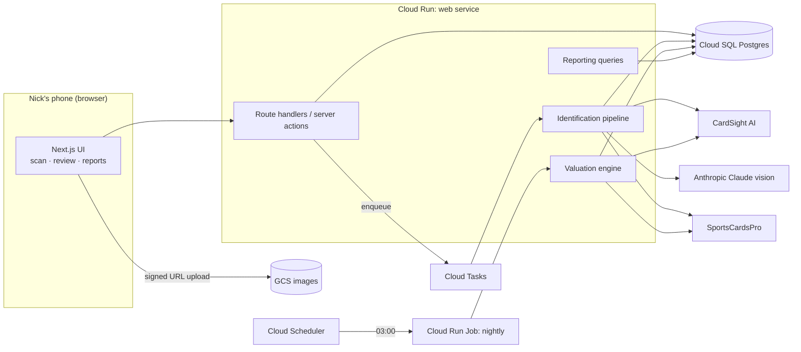

# Card Tracker — V1 Design Document

**Owner:** Nick · **Status:** Draft for build · **Date:** 2026-09-11
**Audience:** Claude Code (implementer) and Nick (product owner)

> **How to use this document (Claude Code):**
> - Save it in the repo as `docs/DESIGN.md` and read it end to end before writing code.
> - Build in the milestone order in §13. Each milestone has acceptance criteria.
> - Never replace a data source with scraping, and don't add features from §16 (Out of scope).
> - Ask Nick before changing a decision marked **[DECISION]**.
> - Defaults marked **[TUNABLE]** are starting points. Keep them in config, not hard-coded.
> - Where this document says **"verify in M_n"**, confirm how the vendor API actually behaves, record it in `docs/adr/`, and adapt. Vendor SDKs change, and the live docs win over this document.

---

## 0. Summary of key decisions

| Area | Decision |
|---|---|
| Product | Single-user, mobile-friendly web app for tracking an NFL card collection as a portfolio. V1 covers **ingestion** and **accurate valuation and reporting** only. |
| Collection profile | 100–500 cards. Mostly **raw** (ungraded), including autos, numbered parallels and base. No PSA slabs yet. Graded cards are supported through label reading plus manual confirmation. |
| Card identification | Photos (front and back) go through a **hybrid pipeline**: the CardSight AI recognition API plus Claude vision reading the printed text. Rules reconcile the two, and **a human always confirms** (explicitly when material value is at risk; otherwise as 'not verified' at the lowest plausible value). The parallel must match exactly on every linked source. |
| Canonical identity | Our own `card` record, holding external IDs (SportsCardsPro product ID, CardSight card/parallel ID, grader spec ID). |
| Pricing: sold comps | **CardSight AI pricing API**: completed **auction** sales per card, raw and graded, grouped by grading company and grade. |
| Pricing: model value | **SportsCardsPro API** (Legendary plan): a daily modeled value per card, ungraded plus every grade tier. |
| Valuation | Our own engine. It takes a recency-weighted median of cleaned comps, blends it with the SportsCardsPro value according to comp strength, and outputs a **value, a low–high range, a confidence level and the method used**. Every result is stored as an immutable daily snapshot. |
| Accuracy proof | A built-in **golden-set validation harness**: Nick hand-comps about 25 cards and the app reports its error against them. |
| Stack | Next.js (App Router) + TypeScript, Postgres (Cloud SQL) + Prisma, Google Cloud Storage, and Cloud Run (web service plus a nightly Cloud Run Job). Cloud Tasks queues identification. Cloud Scheduler and Secret Manager round it out. |
| Explicitly not doing | Scraping eBay, 130point, Card Ladder, TCDB or Beckett. Portfolio recommendations. Selling or listing. Multi-user. |

Estimated running cost: **about $80–95/month steady state**, and up to about $140 in the month the collection is first loaded (§3.5).

---

## 1. Goals, non-goals, success criteria

### 1.1 Goals (V1)
1. **Fast ingestion of 100–500 cards** from phone photos, with a review step that makes exact identification (including parallel and serial number) easy to confirm or correct.
2. **An accurate current market value per owned card.** Every value comes with a range, a confidence level, the method used, and the actual evidence behind it.
3. **Trustworthy portfolio reporting:** total value, cost basis, gain/loss, value over time, movers and allocation.
4. **Measurable accuracy.** The app reports its own identification accuracy and valuation error against a hand-verified golden set.

### 1.2 Non-goals (V1)
- Buy/sell/grade recommendations, alerts or AI advice (V2; §16 lists the data hooks to keep).
- Marketplace listing, selling or inventory syncing.
- Multi-user accounts, sharing or social features.
- Native mobile app.
- Automated condition grading from photos.

### 1.3 Success criteria (V1 "done")
| Metric | Target **[TUNABLE]** |
|---|---|
| Ingestion time on Nick's timed 25-card mixed batch (M2) | Capture ≤ 25 s per card median; review ≤ 8 s per card for bulk-confirmed and ≤ 40 s for single-card reviews |
| Identification top-1 correct before human correction (all fields except parallel) (measured on the M2 manifest's verified fields, and after load per §9.2) | ≥ 85% |
| Parallel correct before human correction (measured on the M2 manifest's verified fields, and after load per §9.2) | ≥ 70%, and **every uncertain parallel is flagged for review** |
| Golden cards ≥ $10 valued with `comps_window_days` = 90 and `comps_n` ≥ 3 | Median \|ln error\| ≤ 0.18 (≈ 20%) |
| All golden cards ≥ $10 | Median \|ln error\| ≤ 0.30 (≈ 35%) |
| Golden cards < $10 | Median absolute error ≤ $2 |
| Range coverage on the next-sale backtest (§9.2) | ≈ 80% (70–90%) |
| Calibration | Median \|ln error\| high < medium < low |
| Share of value at high or medium confidence | Reported, no target |
| Nightly valuation job success rate | ≥ 99% over the trailing 30 nightly runs after the full load, with partial failures isolated per card |

---

## 2. Market primer (just enough to value cards correctly)

Nick is new to the hobby, and most "inaccurate price" complaints about existing apps come from getting these wrong:

- **A card's identity is more than the player.** A value applies only to an exact card: *year + manufacturer + set + insert/subset + card number + parallel + print run + autograph/memorabilia + variation*. A 2020 Prizm Justin Herbert #325 **Base**, **Silver** and **Gold /10** are three different cards whose prices differ by 10–1000×.
- **Parallels** are color or finish versions of the same card (Silver, Holo, Red /299, Gold /10 …). They're hard to tell apart in a flat photo, and they're the #1 identification error in scanner apps.
- **Serial numbering** ("23/99") is stamped on the card. The **denominator (/99) identifies the parallel.** The owned number (23) usually doesn't change value, except for 1/1s and numbers matching the player's jersey.
- **Inserts and case hits** (Kaboom, Downtown, Color Blast …) are separate cards, not parallels.
- **Rookie card (RC)** status comes from the checklist, never from listing titles. Sellers routinely mislabel cards as rookies.
- **Autographs:** signed and unsigned versions of a card differ by 10–20×. Scanner apps are known to confuse them.
- **Raw vs graded.** A raw card's price is a blend of market conditions (roughly near-mint). Graded cards (PSA, BGS, SGC, CGC …) are priced **per grader and per grade**. PSA 10 premiums have compressed in recent years, and PSA 9s often trade close to raw.
- **Comps** = recent **sold** prices for the exact same card and grade. Asking prices aren't comps. CardSight's Buy-It-Now records are asking prices and are never used as comps.
- **Data traps:**
  - **eBay Best Offer** sales show the asking price, not the accepted price.
  - **Shill bidding** inflates auctions.
  - **Lot sales** and mis-titled listings pollute searches.
  - **Thin markets:** many cards have 0–2 sales a quarter.
- **Licensing change:** Topps/Fanatics holds the NFL license from 2026, and Panini football products are no longer NFL-licensed. Expect catalog gaps for new 2026 sets, and keep the manual entry path.

---

## 3. Data source strategy

### 3.1 What's available (researched Sept 2026)
| Source | What it gives us | API | Cost | Role in V1 |
|---|---|---|---|---|
| **CardSight AI** | Image identification (parallel-aware; **one image per identify call**; use `identify.cardBySegment('football', …)`), catalog (cards, sets, `catalog.parallels.list/get`), **price records per card, split raw vs. graded by company and grade: completed auction sales plus Buy-It-Now asking prices** (`listing_type` auction\|fixed\|both, default both). Documented per-record fields: price (USD float — ADR-0001), date, source, listing_type, optional title, url, image_url, parallel_id (null = base), parallel_name. **ADR-0001: `parallel_id` and `parallel_name` are never populated on football pricing records; parallel isolation does not work.** Also active listings | Yes. REST + Node SDK (`cardsightai` v4), API key. `identify.cardBySegment('football', …)`, `catalog.*`, **`pricing.get` (accepts a parallel ID but it has no effect — ADR-0001)**. `pricing.get` query: `parallel_id` (UUID, or 'null' = base only), `period`, `listing_type`, `as_of_date` (YYYY-MM-DD), `limit`; ≤500 rows per call, page older rows with `as_of_date`. `pricing.bulk` (≤100 cards) **takes no parallel ID**, so V1 doesn't use it for comps. | Free 750 calls/mo · Pro $14.95 (5k) · Premium $74.95 (30k) · overage ≈ $0.003/call | **Primary identification + ~~primary sold comps~~ comps role TBD (ADR-0001)** |
| **SportsCardsPro** (PriceCharting's sports site) | Daily modeled value per card: ungraded, grades 1–9.5, and company-specific 10s. Each parallel is its own product. Yearly `sales-volume`. | Yes. `GET /api/product?id=` or `?q=`, `/api/products?q=` (≤100; ADR-0001 confirmed), token `t`, **1 call/sec**, prices in **pennies**, response shape `{ products: [...] }`. Daily CSV per set. | **Legendary $49/mo** (required for API) | **Model value + catalog cross-check + fallback** |
| **Vision text extractor** (pluggable: OpenAI or Claude) | Reads printed text on the card front and back and on slab labels. Returns structured JSON validated against the Appendix A schema. **The vision provider is pluggable** (M2-001): set `ANTHROPIC_API_KEY` for Claude or `OPENAI_API_KEY` for OpenAI; Claude wins when both are present. Model overridable via `ANTHROPIC_VISION_MODEL` / `OPENAI_VISION_MODEL`. Current default: OpenAI `gpt-5.6-terra`. | Yes | ≈ $0.02/card (OpenAI Terra) or ≈ $0.05/card (Claude Sonnet) | **Text extraction / second opinion** |
| Card Hedge | Comps with anomaly filtering, FMV with confidence, cert lookup, image search | Yes, but subscription pricing is sales-only. Pay-per-call runs over x402 (USDC). | $0.01–0.02/call | **Optional adapter (V1.1)** if CardSight comps prove weak |
| PSA Public API | Cert lookup for PSA slabs | OAuth token. **The free tier's status is unclear as of mid-2026.** | Free / unclear | Optional adapter. Nick has no PSA slabs today. |
| Ximilar | Card ID + slab label reading (grader, grade, cert) | Yes | Free 1k credits/mo | Optional fallback identifier |
| Card Ladder Pro, Market Movers, 130point, eBay Product Research | Best-in-class manual comp research | **No API. Terms of service ban scraping.** | $0–25/mo | **Manual use only**, to build the golden set (§9) |
| eBay APIs | Finding API shut down Feb 2025. Marketplace Insights (sold data) is Limited Release and not realistically obtainable. Browse API covers active listings only. | — | — | **Not used** |
| TCDB, Beckett | Checklists | No API. TCDB's terms ban scraping, and Beckett has sued over data copying. | — | **Not used** (manual reference links only) |

### 3.2 Why this combination
- **Two partially overlapping price signals.** Both come largely from eBay, so agreement mainly guards against identity errors (wrong card or parallel) rather than independently confirming price. CardSight provides auction comps we can inspect, filter and explain; SportsCardsPro provides a curated daily model. When they diverge, confidence drops and the card may go to review.
- **Parallel granularity.** Both sources treat parallels as distinct records, which is essential for modern NFL cards.
- **Legitimate access.** Both are paid, documented APIs whose terms allow a personal app.
- **Transparency.** The comps behind a value can be shown, which fixes the #1 complaint about CollX and Ludex.

### 3.3 Terms-of-service constraints that shape the design **[DECISION]**
1. **SportsCardsPro:** data is for internal use. The app must stay **private to Nick** (authenticated, no public pages). Storing its daily values as our price history is acceptable for internal use.
2. **CardSight:** individuals may use it for personal, non-commercial purposes. Its terms allow caching only "on a limited, short-term basis" and **forbid building a standalone database of card information**. Therefore:
   - Raw CardSight responses (comps, catalog payloads) go in a **cache table with a TTL** (default 8 days **[TUNABLE]**, longer than the weekly comps refresh) and are purged by a job. A cache row is replaced only after a successful fetch.
   - We persist **only our derived outputs** (our valuation, the comp count, the last sale date, dispersion) plus **CardSight IDs** as foreign references.
   - The "Why this value" screen re-fetches comps if the cache has expired.
   - If the CardSight subscription ends, a command deletes all cached CardSight data.
   - **Open item for Nick:** email CardSight support to confirm that storing derived daily valuations is fine for personal use (§15).
3. **No scraping, anywhere.** If a source doesn't have an API, it's manual-only.
4. **Anthropic API:** send only card images, never personal data.

### 3.4 Provider abstraction
All external services sit behind interfaces so sources can be swapped, mocked in tests and compared:

```ts
interface CardIdentifier {           // CardSightIdentifier, (later) XimilarIdentifier
  // CardSightIdentifier always uses the football segment
  identify(images: ImageRef[]): Promise<IdentifyCandidate[]>;
}
interface TextExtractor {            // ClaudeVisionExtractor
  extract(images: ImageRef[], kind: 'raw' | 'slab'): Promise<CardExtraction>;
}
interface CatalogProvider {          // CardSightCatalog, SportsCardsProCatalog
  search(q: CatalogQuery): Promise<CatalogCard[]>;
  getParallels(setRef: ExternalRef): Promise<Parallel[]>;
}
type UnavailableReason = 'rate_limited' | 'quota_exceeded' | 'timeout' | 'server_error' | 'invalid_payload';
type CompsResult = { status: 'ok'; sales: Sale[] } | { status: 'unavailable'; reason: UnavailableReason };
// Only { status: 'ok', sales: [] } means "no sales".
interface CompsProvider {            // CardSightComps, (later) CardHedgeComps
  // ADR-0001: CardSight `parallel_id` on pricing records is never populated for football cards.
  // The adapter fetches with `parallel_id: 'null'` (returns all records for the card regardless of parallel),
  // then relies on the engine's title-based parallel filtering (§7.2 step 5, ADR-0002) to isolate records.
  // Records without titles are excluded (§7.2 step 0).
  // The adapter MUST paginate `catalog.parallels.list` completely for the card's release and pass the full
  // parallel vocabulary to the engine. A truncated vocabulary is treated as `unavailable` (reason `invalid_payload`);
  // the engine falls back to model-only. If the 500-row cap warning is returned, page with `as_of_date` (YYYY-MM-DD).
  getSales(ref: { cardId: string; parallelId: string | null }, opts?: { period?: '3m' | '1y'; asOfDate?: Date }): Promise<CompsResult>;
}
type ModelPriceResult = { status: 'ok'; table: GradePriceTable } | { status: 'unavailable'; reason: UnavailableReason };
interface ModelPriceProvider {       // SportsCardsProPrices
  getPrices(productIds: string[]): Promise<Map<string, ModelPriceResult>>;   // tagged status per product
}
interface CertProvider {             // (optional) PsaCertProvider, CardHedgeCertProvider
  lookup(grader: Grader, cert: string): Promise<CertResult | null>;
}
```

Every adapter must:
- Normalize its data into our types (§5.3).
- Enforce the provider's rate limit **across all processes**. Use the Postgres-backed limiter: reserve a slot atomically in one statement with no explicit transaction: `UPDATE rate_limit SET next_allowed_at = GREATEST(next_allowed_at, now()) + $interval WHERE provider = $1 RETURNING next_allowed_at - $interval AS slot`, then sleep until `slot` outside any transaction. SportsCardsPro interval = 1100 ms. On 429, set `next_allowed_at = now() + backoff` so every process slows. **Never hold a DB transaction across an external HTTP call.** This matters most for SportsCardsPro: its limit is 1 req/s, and breaking it risks suspension.
- Retry with exponential backoff on 429 and 5xx.
- Record usage in `api_usage` for cost tracking.
- Have a **Fake** implementation backed by JSON fixtures, used in all automated tests and local dev by default (`PROVIDERS_MODE=fake|live`).

### 3.5 Monthly cost estimate
| Item | Steady state | Ingestion month |
|---|---|---|
| SportsCardsPro Legendary | $49 | $49 |
| CardSight Pro: 5k calls, plus ≈$0.003/call overage. Comps are refreshed on a value-tiered schedule (§7.13), about 3.5k calls/mo for 500 cards; identifying ~500 cards takes ~500–1,000 calls, one-time. Validation replay and as_of_date paging add a few calls per run; overage at ≈$0.003/call is the backstop. | $14.95 | $15–45 |
| Anthropic API (vision, 2 images per card) | ~$1 | ~$5–15 |
| GCP: Cloud Run (scale to zero), Cloud SQL smallest shared-core instance, GCS, Tasks, Scheduler | ~$15–30 | ~$15–30 |
| **Total** | **≈ $80–95/mo** | **≈ $85–140** |
| Optional: Card Ladder Pro, for hand-comping the golden set | +$20 | +$20 |

SportsCardsPro linkage makes ≤ 3 `/api/products` calls per identification (≈ 25 minutes at 1 req/s for 500 cards, one-time), in addition to ~15k nightly product calls per month at 1 req/s; SportsCardsPro is flat-rate, so these cost time, not money.

`api_usage` feeds a small "API usage this month" panel on the Settings page, and a warning appears at 80% of the plan quota.

Cloud SQL is the largest infrastructure line. Nick already uses it, so it's the default. A cheaper managed Postgres such as Neon or Supabase would also work, since the app only needs a `DATABASE_URL` (§15.2).

---

## 4. System architecture

### 4.1 Stack **[DECISION]**
| Layer | Choice | Notes |
|---|---|---|
| Language | TypeScript (strict) on Node 22 LTS | The CardSight SDK requires Node ≥ 22 |
| Web framework | Next.js, current stable, App Router, server actions + route handlers | One deployable for UI and API |
| UI | Tailwind CSS + shadcn/ui; Recharts for charts | Mobile-first layouts, dark mode |
| DB | PostgreSQL 16 (Cloud SQL in prod, Docker locally) | |
| ORM / migrations | Prisma | Prisma `connection_limit` = 5 for the web service and 3 for the nightly job; Cloud Run web `max-instances` = 3. |
| Validation | Zod, for every external payload and form | |
| Images | Private Google Cloud Storage bucket (no object versioning). The client re-encodes each photo (which drops EXIF), and `sharp` on the server strips again, normalizes rotation and makes thumbnails. | Uploads go straight to GCS via signed URLs |
| Short jobs | `JobQueue` interface: `LocalQueue` (in-process, dev) / `CloudTasksQueue` (prod, pushes to authenticated route handlers). Used for `identify` and `value-item`. | No always-on worker |
| Nightly job | **Cloud Run Job** (`node dist/jobs/nightly.js`) started by Cloud Scheduler. It runs the steps sequentially in one process, so no fan-out or fan-in is needed; ~15 min for 500 cards. | Locally: `pnpm job:nightly`. `deploy.sh` creates it with `--task-timeout=2h --max-retries=0`, and the Scheduler job with `--time-zone=$APP_TIMEZONE`. Cloud Run Jobs otherwise default to a 10-minute timeout and 3 retries (each retry re-runs every paid call), and Scheduler to UTC. |
| Auth | Auth.js with the Google provider and a **single-email allowlist** (`ALLOWED_EMAILS`) | Every page and API route requires a session, except `/api/tasks/*`, which verify OIDC |
| Secrets | GCP Secret Manager in prod, `.env.local` in dev | |
| AI | `@anthropic-ai/sdk`. Model ID set in config (`ANTHROPIC_VISION_MODEL`); use a current Claude model with vision and structured outputs. | |
| Tests | Vitest (unit/integration), Playwright (E2E, mobile viewport) | |
| Infra | A documented, idempotent `gcloud` script in `/infra/deploy.sh` (Terraform isn't worth it for one user) | |

### 4.2 Component diagram



### 4.3 Repository layout
```
/app                      Next.js routes (UI + /api)
  /(app)/dashboard
  /(app)/collection        holdings table
  /(app)/cards/[itemId]    card detail + "why this value"
  /(app)/scan              batch capture
  /(app)/review            identification review queue
  /(app)/validation        golden set + accuracy report
  /(app)/settings          fees, valuation params, API usage
  /api/uploads/sign        (signed PUT URL for items/{itemId}/{side}-{sha}.jpg)
  /api/uploads/complete    (verify object + sha256 → sharp strip/rotate/thumbnail → write item_photo → if front+back, front+label (slab), or front with No back photo present: status identifying + enqueue identify; idempotent on (itemId, side, sha256); enqueues identify only if the item has no `queued` or `running` identification)
  /api/tasks/identify      (Cloud Tasks target)
  /api/tasks/value-item    (Cloud Tasks target: fetch model price + comps for one item, value it, rebuild today's snapshot)
/jobs/nightly.ts          Cloud Run Job entrypoint (abandoned-run check → model prices → comps → valuations → backtest → snapshot → cache purge)
/src
  /domain                 pure types + logic (NO I/O): identity, grades, valuation, portfolio math
  /providers              cardsight/, sportscardspro/, anthropic/, psa/ (each with live + fake)
  /pipeline               identification orchestration + reconciliation
  /jobs                   queue interface, job handlers
  /db                     prisma client, repositories
  /lib                    rate limiter, retry, money, dates, logging
  /ui                     copy.ts (all user-facing copy, §8.2), help/ (static help panels, §6.7)
/prisma                   schema + migrations + seed
/fixtures                 provider payloads in the shapes recorded in ADR-0001 with synthetic values (prices, dates, IDs and URLs replaced; never real CardSight sale records, per §3.3), sample card images, valuation/examples.json (§7.12)
/spike                    M0.5 throwaway vendor scripts (never imported by /src)
/tools/oracle             independent reference valuation script for frozen examples (§7.12; shares no code with /src/domain)
/tests                    unit, integration, e2e
/infra                    deploy.sh (gcloud)
/docs                     this document, ADRs
```

**Rule:** `/src/domain` has no I/O and full unit test coverage. The valuation engine must be a pure function: `(inputs, config) → ValuationResult`.

---

## 5. Data model

Conventions:
- **Money** is always integer cents. Use `Int` per card and `BigInt` for totals.
- **Timestamps** are UTC.
- **Business dates** (valuation and snapshot days) use `APP_TIMEZONE` **[TUNABLE]**, default `America/Los_Angeles`. Day **D** is the local calendar date on which a job runs.
- **Rounding:** calculations run on floats in the domain layer; round value, low and high **once, half-up, before any money threshold is evaluated** (§7.7 step 11b).

### 5.1 Core tables

**`card`**: the canonical card identity (a checklist entry, not a physical copy)
| Column | Type | Notes |
|---|---|---|
| id | uuid PK | |
| identity_key | text UNIQUE | Normalized: `year|manufacturer|set|subset|card_no|player_slug|parallel_slug|print_run|auto|memo|variation` |
| year | int | Season year of the set (e.g., 2020) |
| manufacturer | text | Panini, Topps, Upper Deck, Leaf … |
| set_name | text | "Prizm", "Donruss Optic" |
| subset | text null | Insert name, e.g., "Kaboom!" |
| card_number | text | Text, because values like "RS-JH" occur |
| players | jsonb | `[{name, team, position}]`; supports dual cards |
| parallel | text null | null = base; "Silver", "Red Wave" … |
| print_run | int null | 99 for /99; 1 for 1/1 |
| is_auto | bool | |
| auto_type | enum null | on_card, sticker, cut, unknown |
| is_memorabilia | bool | Relic/patch |
| is_rookie | bool | From catalog/checklist only |
| variation | text null | SP, SSP, image variation, etc. |
| licensed | enum | nfl_licensed, nflpa_only, unlicensed, unknown |
| sportscardspro_id | text null | Must be the product for the **same parallel** (§6.4) |
| sportscardspro_name | text null | e.g. "Justin Herbert [Silver] #325", shown on review and detail screens |
| cardsight_card_id | text null | |
| cardsight_parallel_id | text null | null = base |
| psa_spec_id | text null | |
| reference_image_url | text null | Hotlinked from a provider if permitted; otherwise not stored |
| created_at / updated_at | timestamptz | |

Partial unique index on (cardsight_card_id, coalesce(cardsight_parallel_id,'base'), is_auto, coalesce(variation,'')) WHERE cardsight_card_id IS NOT NULL.

**Card identity fields are immutable after creation.** Editing an item's identity (review, or §8.2 Edit identity) re-points `item.card_id` to the matched or newly created card and never mutates the old card. Changing a card's SportsCardsPro link applies to every item on that card, and the UI says 'affects N items'.

**`item`**: a physical copy Nick owns (or owned)
| Column | Type | Notes |
|---|---|---|
| id | uuid PK | |
| card_id | uuid FK null | Null until identification is confirmed |
| scan_session_id | uuid FK null | |
| session_seq | int null | 1, 2, 3… per session, shown as `#seq` (§6.2) |
| status | enum | See the lifecycle below |
| serial_number | int null | The "23" in 23/99 |
| condition_kind | enum | `raw`, `graded` |
| raw_condition_tier | enum null | `market` (default = typical raw copy / not sure), `nm_mt`, `ex_mt`, `ex`, `vg`, `poor` |
| grader | enum null | PSA, BGS, SGC, CGC, TAG, ACE, OTHER |
| grade | numeric(3,1) null | 1–10 |
| grade_label | text null | "Pristine", "Black Label", "Auth" |
| auto_grade | numeric(3,1) null | Dual-grade slabs |
| cert_number | text null | The verification link is **derived** from grader + cert (no column) |
| storage | enum | `toploader`, `penny_sleeve`, `binder`, `magnetic`, `slab`, `none`, `unknown` (matches how Nick sorts cards today) |
| acquired_on | date null | |
| acquired_via | enum | purchase, pack_pull, trade, gift, unknown |
| cost_price_cents | int **null** | **null = unknown cost**, 0 = known free (e.g., a gift) |
| cost_tax_cents / cost_shipping_cents / cost_fees_cents / cost_grading_cents | int default 0 | |
| notes | text | |
| sold_on | date null | The actual sale date (used for realized G/L) |
| sold_price_cents / sold_fees_cents / sold_shipping_cents | int null | |
| removed_on | date null | Set when status becomes `sold` or `removed`: the date **entered in the app** (used for snapshot removals, §8.1) |
| manual_value_cents | int null | Override; see §7.8 |
| manual_value_note | text null | |
| manual_value_set_at | timestamptz null | |
| identity_unverified | jsonb null | Set by **Not sure** in review (§6.7): alternate candidates with SCP values |
| created_at / updated_at | timestamptz | |

**Item lifecycle:**
- `draft`: created on the first Front capture; photos are still uploading.
- → `identifying`: Back photo uploaded (Label for slabs), or **No back photo** tapped; `identify` enqueued.
- → `needs_review`: identification finished, whatever its confidence.
- → `owned`: Nick confirmed it.
- → `sold` / `removed`.
- Drafts older than 30 minutes **[TUNABLE]** appear in Review › Identification as **Incomplete scan** with Resume / Delete, and are counted in the dashboard Needs-attention counts; never auto-deleted. `/scan` lists open sessions with Resume.

Review actions:
- **Skip** leaves the item in `needs_review`.
- **Not a card / delete** hard-deletes a draft or needs_review item along with its photos.
- Items with any valuation row can't be hard-deleted; use Remove.
- An identification error leaves the item in `identifying`, with the identification set to `failed` and a Retry button.

`cost_basis_cents` = null if `cost_price_cents` is null. Otherwise it's the sum of all cost_* columns. Break/box cost allocation is V1.1 (§16).

**`item_photo`**
| id | item_id FK | side enum (`front`, `back`, `front_tilt`, `label`, `serial_closeup`) | gcs_path | width | height | sha256 | created_at |

**`scan_session`**: one batch-capture session
| id | label text (asked at session start, e.g. 'Toploader box 1') | started_at | ended_at | defaults jsonb (`{storage, set_hint}`, chosen on one start-of-session prompt pre-filled from the previous session; session defaults never set `raw_condition_tier`) | count_total | count_confirmed |

**`identification`**: one per item, per attempt
| Column | Notes |
|---|---|
| id, item_id, scan_session_id | |
| status | `queued`, `running`, `ready` (high confidence), `needs_review`, `confirmed`, `failed` |
| extraction | jsonb: Claude vision output (Appendix A schema) |
| candidates | jsonb: ranked list of our **derived** candidates, each `{identity fields, cardsight_card_id, cardsight_parallel_id, scp_product_id, scp_product_name, est_value_cents, score, reasons[], rejects[]}` |
| cardsight_cache_key | text: pointer to `provider_cache` (raw response, TTL) |
| chosen_candidate_index | int null |
| overall_confidence | numeric 0–1 (top candidate's score) |
| was_ready | bool: true if the pipeline set status `ready`. Kept after confirmation, for the false-confidence metric. |
| est_value_max_cents | int null: max RAW SCP value across plausible parallels (§6.3 step 7), used to sort the review queue |
| value_at_risk_cents | int null: max − min RAW SCP value across plausible parallels |
| value_at_risk_partial | bool: true if any plausible parallel had no mapped SCP product |
| explicit_fields | text[]: fields Nick explicitly picked (or marked **Not sure**) while an `at_risk` flag blocked (§6.7) |
| confirmed_via | enum null: `single`, `bulk`, `audit` |
| flags | `IdentificationFlag[]` (§5.3) |
| failure_reason | enum null: `quota_exhausted`, `provider_unavailable`, `image_unreadable`, `internal` (§6.3 Failures) |
| error | text null |
| created_at, updated_at, completed_at, confirmed_at | |

**`identification_correction`**: one row per field the user changed during review (feeds the accuracy metrics)
| id | identification_id | field (`player`, `year`, `set`, `subset`, `card_number`, `parallel`, `print_run`, `auto`, `memorabilia`, `rookie`, `grader`, `grade`) | predicted jsonb | corrected jsonb | created_at |

### 5.2 Pricing, valuation and validation tables

**`provider_cache`**: TTL cache for raw third-party payloads (CardSight terms)
| key (text PK) | provider | payload jsonb | fetched_at | expires_at (required) |

The nightly job purges expired rows.

**`model_price`**: SportsCardsPro daily values (internal-use history). **One row per card per day.**
| id | card_id | as_of_date | product_id | prices jsonb (`{ "RAW": 20000, "GRADED:9": 26000, "PSA:10": 61000, … }` in cents, only non-zero fields) | sales_volume_yearly int null | fetched_at | UNIQUE(card_id, as_of_date) |

Readers filter by `product_id = card.sportscardspro_id`, so a re-link never splices two products' histories.

**`valuation`**: per-item daily valuation (**the source of truth for reporting**)
| Column | Notes |
|---|---|
| id, item_id, as_of_date | UNIQUE(item_id, as_of_date). Rows for today may be replaced; rows for past dates are immutable. |
| card_id | uuid: the item's card at valuation time (position key, §8.1) |
| grade_key | e.g. `RAW`, `PSA:10`, `BGS:9.5`, `BGS:10B` |
| raw_condition_tier | The item's raw condition tier at valuation time (position key, §8.1) |
| value_cents | Final value (after condition adjustment / manual override) |
| low_cents, high_cents | ≈80% next-sale interval (§7.7). For `manual`, low = high = value. |
| market_value_cents, market_low_cents, market_high_cents | The computed market estimate (equals value unless manual) |
| net_value_cents | After estimated selling costs (§7.9) |
| confidence | `high`, `medium`, `low`, `none` |
| confidence_reasons | text[]: the binding reason codes from the §7.4 confidence table |
| method | `comps_strong`, `comps_only`, `blend`, `model_primary`, `model_only`, `grade_inferred`, `manual`, `unpriced` |
| comps_tier | `STRONG`, `OK`, `WEAK`, `NONE` |
| comps_window_days | 90 / 180 / 365 / null |
| comps_estimate_cents, comps_n, comps_n_excluded, comps_n_eff, comps_last_sale_on, comps_dispersion | Derived stats only (never raw comps). |
| model_value_cents, model_sales_volume | SportsCardsPro value for this grade key |
| divergence | `|ln(C/M)|`, when both exist |
| flags | `ValuationFlag[]` (§5.3) |
| algorithm_version | semver, bumped on any change to engine behavior or defaults |
| config_hash | Hash of the valuation config used |
| fees_version | `settings.version` of the fee config used for net value |
| created_at | |

**`portfolio_snapshot`**: one row per business date. Today's row is rebuilt after any change (§7.13); past rows are immutable.
| as_of_date PK | total_value_cents | total_net_value_cents | total_cost_basis_cents (known-cost items) | items_owned | items_priced | items_unpriced | items_unknown_cost | items_stale | unpriced_cost_basis_cents | items_unvalued | items_unconfirmed (draft + identifying + needs_review at build time) | known_cost_value_cents | value_high_conf_cents | value_med_conf_cents | value_low_conf_cents | additions_value_cents | removals_value_cents | adjustments_value_cents | revaluation_cents | market_change_cents | algorithm_version | config_hash | prev_snapshot_date | created_at | updated_at |

**`golden_comp`**: Nick's hand-comped reference values (§9). **Kept separate from `manual_value_cents`, and never used for valuation.**
| id | item_id FK | grade_key | sales jsonb (3–5 rows: price_cents, sold_on, url) | value_cents (median of those rows, computed by the app) | no_reliable_comp bool | condition_basis (`market` default, or a raw tier) | blind bool | comped_on date | method_note text | created_at |

Re-comping adds a new row; history is kept.

**`validation_run`**
| id | kind (`golden`, `backtest`) | config_source (`active`, `candidate`) | run_at | algorithm_version | config_hash | golden_count | metrics jsonb (§9.2) |

**`settings`**: versioned configuration
| id | kind (`valuation`, `fees`) | version int | data jsonb (Zod-validated) | hash | active bool | created_at |

Exactly one active row per kind. Fee settings are a **separate kind**, so editing fees doesn't change the valuation `config_hash`.

**`api_usage`**
| provider | endpoint | date | calls int | est_cost_cents int | PK(provider, endpoint, date) |

**`job_run`**
| id | job (`nightly`, `identify`, `value-item`) | as_of_date null | status (`running`, `succeeded`, `partial`, `failed`) | started_at | finished_at | stats jsonb (counts per step, failed item IDs) | error text |

**`flag_dismissal`**
| id | item_id FK | flag | dismissed_value_cents | dismissed_at | UNIQUE(item_id, flag) |

**`rate_limit`**
| provider PK | next_allowed_at timestamptz |

### 5.3 Normalized domain types and flag enums

```ts
type Grader = 'PSA' | 'BGS' | 'SGC' | 'CGC' | 'TAG' | 'ACE' | 'OTHER';
type GradeKey = string;   // 'RAW' | /^(PSA|BGS|SGC|CGC|TAG|ACE|OTHER):(10B|10P|\d{1,2}(\.5)?)$/  e.g. 'PSA:10', 'BGS:9.5', 'BGS:10B'
type SaleType = 'auction' | 'fixed_price' | 'best_offer_accepted' | 'best_offer_unknown_price' | 'unknown';

interface Sale {
  providerSaleId?: string;     // may be absent; recorded in ADR-0001 (M0.5)
  soldAt: Date;
  priceCents: number;          // price paid for the item, excluding shipping
  buyerPremiumCents?: number;
  shippingCents?: number;
  saleType: SaleType;          // 'unknown' if the provider doesn't say
  marketplace: string;         // provider 'source' value, normalized: 'ebay', 'fanatics_collect', ...
  gradeKey: GradeKey;
  title?: string;              // optional: CardSight documents an optional title
  url?: string;
}

interface Parallel {
  id: string;
  name: string;
  printRun: number | null;
  printRunKind: 'fixed' | 'variable';   // 'variable' = per-player print runs (stat-line or jersey-number parallels),
                                        // as shown by the catalog (ADR-0001); a non-null printRun defaults to 'fixed'
}

interface GradePriceTable {    // SportsCardsPro, normalized; mapping in Appendix B
  productId: string;
  productName: string;
  setName: string;
  salesVolumeYearly?: number;
  prices: Partial<Record<string, number>>;   // keys: 'RAW', 'PSA:10', 'BGS:10', 'BGS:10B', 'CGC:10', 'CGC:10P',
                                             // 'SGC:10', 'TAG:10', 'ACE:10', 'GRADED:1'..'GRADED:9.5' (cross-grader)
}
```

**Identification flags:**

Every flag declares a blocking mode; a unit test asserts the registry covers every flag enum value. Blocking modes: `always`; `at_risk` (blocks only when `value_at_risk_cents` ≥ REVIEW_THRESHOLD **[TUNABLE, default $5]**, or when value at risk is unknown or partial); `never`.

| Flag | Meaning | Blocking mode |
|---|---|---|
| `parallel_uncertain` | Parallel not resolved by §6.5 | `at_risk` |
| `serial_unreadable` | Numbered card suspected, digits not read | `at_risk` |
| `serial_mismatch` | Read denominator doesn't match any parallel in the set | `at_risk` |
| `providers_disagree` | CardSight top-1 ≠ our top-1 | `at_risk` |
| `auto_uncertain` | Autograph presence or type unclear | `at_risk` |
| `rookie_conflict` | Printed RC logo vs catalog `is_rookie` disagree | `never` (warning) |
| `no_catalog_match` | No candidate above threshold | `always` |
| `no_scp_match` | No SportsCardsPro product for this exact parallel | `never` (valuation uses comps only) |
| `photo_quality` | Vision model reports major glare/blur or card not fully in frame | `at_risk` |
| `no_back_photo` | Nick tapped **No back photo**; identified front-only (§6.2) | `at_risk` |
| `variation_possible` | The catalog lists more than one card for the same set + card_number + player (§6.5 step 6) | `at_risk` |
| `redemption` | The card is a redemption card (§6.3 step 3) | `always` |

**Valuation flags:** `divergent`, `stale_comps`, `thin_market`, `condition_adjusted`, `raw_capped`, `model_cross_grader`, `grade_inferred`, `auto_grade_ignored`, `manual_stale`, `big_move`, `identity_unverified`.

**Computed at read time (not stored):** `stale_valuation`. It applies when an item's latest valuation is from an earlier date than the report date, usually because that day's valuation failed. `/src/domain/portfolio` derives it.

---

## 6. Ingestion

### 6.1 Flows
1. **Photo scan (primary)**: a batch session of front + back photos per card (or front only, with an explicit **No back photo** tap). §6.2–6.5.
2. **Graded slab scan**: a photo of the front plus the label (both required before **Next card**), read by the vision model and confirmed by Nick. §6.6.
3. **Search and add (manual)**: type a query (e.g., "2023 Prizm CJ Stroud silver"), pick from catalog results, pick a parallel, set serial and condition.
4. **Unmatched / custom card**: when no catalog match exists (e.g., brand-new 2026 Topps sets), create a `card` with no external IDs. It's valued manually (method `manual`, or `unpriced` until Nick enters a value) until it's linked.

CSV import is deferred to V1.1 (§16). With 100–500 cards, photo scanning is the fast path.

### 6.2 Capture UX (mobile web)
- `/scan` starts a `scan_session`. Big buttons: **Front**, then **Back**, then **Next card**. An optional "+ Tilt shot" helps catch refractor shimmer; "+ Serial close-up" appears when the vision model reports a serial it couldn't read.
- 'Next card' requires a Back photo or an explicit **No back photo** tap, which enqueues identify front-only and sets identification flag `no_back_photo`. Slab cards require Front + Label instead.
- Show the session label and `#seq` on the capture screen, every tray chip, retake prompts, the review screen and card detail ('Toploader box 1 · #37'). First-use tip: 'Keep scanned cards in a stack in scan order until this session is reviewed.' Retake requests are listed at the top of the tray ('#12 serial close-up · #19 glare').
- Capture uses `<input type="file" accept="image/*" capture="environment">`, which is reliable on iOS Safari and Android Chrome. A live `getUserMedia` viewfinder is optional polish, not required.
- **On-screen tips** (dismissible, shown on first use):
  - **Leave cards in their sleeves and toploaders.** Angle the card slightly so light doesn't reflect straight back. Only take a card out if the app asks for a retake.
  - Use a plain, contrasting background and diffuse light with no flash.
  - Fill the frame.
  - For slabs, tilt 10–15° to kill glare.
  - Always shoot the back.
- **On the first Front capture**, create the `item` (status `draft`) so the upload path exists: `gs://…/items/{itemId}/{side}-{sha}.jpg`.
- **Client-side processing:**
  1. Apply EXIF orientation.
  2. Draw to a canvas and re-encode at a **2400px long edge**, JPEG quality 0.9. Re-encoding **drops all EXIF, including GPS**.
  3. Upload via a signed URL. `deploy.sh` applies bucket CORS: origin [$APP_BASE_URL], methods [PUT, GET], responseHeader [Content-Type], maxAgeSeconds 3600. Signed PUT URLs bind `Content-Type: image/jpeg`.
  4. **No original-resolution uploads in V1.**
- **Server-side (belt and braces):** after upload, `sharp` re-strips metadata, normalizes rotation and writes a 400px thumbnail.
- After each upload, the client calls `/api/uploads/complete`. Once front + back, front + label (slab), or front with **No back photo** exist, that call sets status to `identifying` and enqueues `identify(itemId)`. Nick keeps scanning without waiting. A session tray shows a status chip for each card.
- **Upload resilience:** pending blobs go into **IndexedDB** until the upload succeeds, so they survive an iOS Safari tab reload. Retry with backoff and show an "N uploads pending" banner.

### 6.3 Identification pipeline (job `identify`)
```
1. Load images (front, back, optional tilt / serial close-up).
2. In parallel:
   a. CardSight identify.cardBySegment('football', front)  -> detections with card/parallel IDs + confidence
      (identify accepts ONE image; call again with the back only, using the same method, if the front returns no detection)
      The SDK labels identify.card() as the default (baseball) segment and the API docs describe auto-detection;
      forcing 'football' removes the ambiguity for an NFL-only collection. If several detections come back,
      use the highest-confidence one (M0.5 records the shape).
   b. Claude vision extract(front, back [, tilt, serial])  -> CardExtraction (Appendix A)
3. If extraction.kind == 'not_a_card' -> needs_review with flag no_catalog_match.
   If extraction.kind == 'slab' -> slab path (§6.6).
   If extraction.kind == 'redemption' -> needs_review with flag redemption (always blocking); confirm uses the
   custom card flow (§6.1 flow 4), valued manual or unpriced.
4. Build candidate set:
   - CardSight detections (top 5)
   - If CardSight returned nothing or only low confidence: catalog.search using the extracted fields (top 5)
5. Score each candidate against the extraction (§6.4); apply hard rejects.
6. Parallel resolution (§6.5).
7. SportsCardsPro linkage (<= 3 calls per identification). Other candidates are linked on demand when Nick selects one in review:
   (1) /api/products?q="<year> <set> <player> <card_no>"  (no parallel term, returning the parallel family)
   (2) if (1) returned 100 results (the API cap; see ADR-0001) or the resolved parallel is absent: query with the canonical parallel name
   (3) if still absent and a print run is known: query with '/<print_run>'
   Merge, dedupe, score with the SCP variant of §6.4 and apply its hard reject; keep the best score >= 0.8,
   else flag no_scp_match. Store scp_product_id, scp_product_name, est_value_cents in the candidate.
   Map every plausible parallel left after §6.5 to its SCP product and store est_value_max_cents (max RAW value),
   value_at_risk_cents (max − min) and value_at_risk_partial (true if any plausible parallel had no mapped product).
8. Status:
   - 'ready'  if top score >= 0.85 AND CardSight top-1 is our top-1 AND no `always` or `at_risk` flag (§5.3)
   - otherwise 'needs_review'
   - 'low_stakes' (bulk-confirmable; derived at read time, never stored in identification.status) = no `always`
     flag, and either top score >= 0.85 or a known, non-partial value_at_risk_cents < REVIEW_THRESHOLD, and
     every `at_risk` flag has a known, non-partial value_at_risk_cents < REVIEW_THRESHOLD.
     Everything else needs single-card review.
   Item status -> needs_review in both cases (Nick always confirms; 'ready' and 'low_stakes' enable bulk confirm).
9. Persist identification (derived candidates + flags); raw CardSight payload -> provider_cache (TTL).
```
- **CardSight confidence mapping:** if CardSight returns a categorical confidence, map High/Medium/Low → 0.9/0.7/0.4. **Verify in M0.5 (ADR-0001).**
- **Failures** (timeouts, or 5xx after 3 retries) set the identification to `failed` and show a **Retry** button. The item stays visible in the session tray. A scanned card is never dropped. Record a reason (`quota_exhausted`, `provider_unavailable`, `image_unreadable`, `internal`; a provider `unavailable` result with reason `quota_exceeded` (§3.4) maps to `quota_exhausted`) and show it as one plain-English line on the tray chip.

### 6.4 Candidate scoring and reconciliation
The score is a weighted sum of field agreements **[TUNABLE]**. **When a signal can't be evaluated** (the field is missing on either side), drop its weight and renormalize the remaining weights so they sum to 1.

| Signal | Weight | Match rule |
|---|---|---|
| Card number | 0.25 | Exact match after normalization (strip "#", leading zeros, whitespace; case-insensitive) |
| Year | 0.15 | Exact set year. If only a copyright year was read, accept a match within ±1 for 0.5 credit. |
| Set / release | 0.20 | Exact equality of canonical set IDs (alias map below). If either side has no alias, fall back to token similarity ≥ 0.9 only when both names contain the same DISTINGUISHING_TOKENS **[TUNABLE: 'draft picks', 'update', 'optic', 'elite', 'no huddle', 'choice', 'mega', 'sapphire', 'chrome', 'black']**; otherwise 0. (Token-set ratio scores subset names as 1.0.) |
| Player | 0.20 | Jaro-Winkler ≥ 0.9 against any player on the card |
| Subset / insert | 0.10 | Similarity ≥ 0.8 when both sides have one; 0 if only one side has one |
| CardSight rank bonus | 0.10 | 1.0 credit for rank 1, 0.5 for rank 2, 0 otherwise. **Not used when scoring SportsCardsPro results.** |

**Name aliasing:** `/src/domain/identity/aliases.ts` is a checked-in alias map (set, parallel and insert names from CardSight, SportsCardsPro and extraction → canonical ID), seeded for Prizm, Optic, Select, Mosaic, Donruss, Contenders, Phoenix, Topps Chrome and Bowman Chrome and extended from ADR-0001/M2 data. Normalization: lowercase; '&' → 'and'; strip punctuation; collapse whitespace; for parallels strip a trailing 'prizm' or 'refractor'; then map through the alias map.

**Hard rejects** (the candidate is removed):
- Extracted serial denominator ≠ candidate `print_run` (when both are known) (only when the candidate's `printRunKind` = 'fixed').
- `autograph.present` read with confidence ≥ 0.8 disagrees with the candidate's `is_auto`, only when `autograph.certification = 'manufacturer_certified'`; otherwise keep both auto and non-auto candidates and flag `auto_uncertain`. The help panel explains that a signature without manufacturer certification is valued as the unsigned card; Nick can add a note.
- Memorabilia read with confidence ≥ 0.8 disagrees with the candidate's `is_memorabilia`.
- **SportsCardsPro variant only:** the product's bracketed parallel (e.g. `[Silver]`, or no bracket for base) must have the same canonical parallel ID as the resolved parallel; a colour root never matches a longer name ('red' ≠ 'red wave'). Any print run in the name must match. Otherwise the product is rejected. A wrong-parallel link is worse than no link.

**Slab evidence:** when the candidate was matched from a grader's label, set/release and card number weights are multiplied by 1.5 **before renormalization**, so the score still stays within 0–1.

Flags are set according to the §5.3 definitions.

### 6.5 Parallel resolution (the hardest part, so it gets its own step)
1. Get the set's parallels via `catalog.parallels.list()` (filter by set/release on our side if the API doesn't), cached for 7 days.
2. If a serial denominator was read, keep parallels whose `printRun` equals it plus any `variable` parallels. If exactly one remains, it's resolved; if several remain, flag `parallel_uncertain`. Flag `serial_mismatch` only if none remain.
3. Otherwise filter by the extraction's `finish` fields: color, pattern (wave, shimmer, mojo, scope, cracked ice …), whether a refractor/prizm sheen is visible, and any printed parallel name. Match colour/pattern words against parallel names through the alias map. Never filter to zero: if the filter would remove all parallels, keep the unfiltered set and flag `parallel_uncertain`.
4. If exactly one parallel remains **and** CardSight's top-1 parallel agrees, it's resolved. Otherwise flag `parallel_uncertain` and pre-select the most likely.
5. **Base vs Silver/Holo is never auto-resolved** from a flat photo unless (CardSight and the vision model agree **and** a tilt shot exists) **or** the parallel name is printed on the card. Silver vs base can be a 5–20× value difference. A tilt shot counts toward auto-resolving only when the session storage is `none`.
6. **Variation check.** If the catalog lists more than one card for the same set + card_number + player (base and SP/SSP/image variation), set flag `variation_possible` (`at_risk`, §5.3), pre-select CardSight's top-1 and show both versions side by side (reference images if permitted, else names and values).

### 6.6 Graded slab path (V1: read and confirm)
1. Claude vision reads the label: `grader`, `grade`, `grade_label`, `auto_grade`, `cert_number`, `subgrades`, plus the label description text (year, set, player, card #, parallel).
2. The label description is matched to the catalog as in §6.4 (with slab evidence weighting), and the parallel is resolved from the label text.
3. Nick confirms grader, grade and cert on the review screen. Slabs with a non-numeric grade (Authentic, Altered) are confirmed with grade null and valued `manual` or `unpriced` in V1 (no grade key, no comps, no model).
4. The **verification link** is derived from grader + cert (PSA, BGS, SGC and CGC cert lookup pages) and shown on card detail. Never scrape those pages.

QR/barcode decoding and `CertProvider` lookups (PSA API, Card Hedge) are deferred to V1.1, since Nick has no PSA slabs today.

### 6.7 Review UI (`/review`)
- **Queue order:** `needs_review` items sorted by `identification.est_value_max_cents` desc; among unknown or partial values, print_run ≤ 99 or autograph first, because mistakes on expensive cards cost the most.
- **The card screen (mobile):**
  - Nick's photos (swipe front/back/tilt, pinch zoom) next to the candidate's reference image when available.
  - The **top 3 candidates** as tappable cards with score and reasons ("✓ #325 ✓ 2020 ✓ Prizm ✗ parallel uncertain"), plus the linked SportsCardsPro product name.
  - Identity fields, editable, with **catalog-driven pickers** (set → parallel list with print runs). No free text for parallel unless "Not in catalog" is chosen.
  - Serial input, validated so that `serial ≤ print_run`.
  - Toggles for Auto (with type), Memorabilia and Rookie (pre-filled from the catalog, with a warning on `rookie_conflict`).
  - Condition: **Raw** or **Graded** (grader, grade, cert). The Raw picker offers plain-language choices over the existing enum: "Looks pack-fresh: sharp corners, no marks" → `market`; "Light wear: a slightly soft corner or small edge chip" → `ex_mt`; "Clear wear: rounded corners, scratches, whitening" → `ex`; "Damaged: crease, stain, writing" → `poor`; `nm_mt` and `vg` under "More". Show the effect inline, e.g. "Light wear: ~$18 instead of ~$30 (rough estimate)".
  - Storage: Toploader / Penny sleeve / Binder / None …
  - Cost basis (collapsible): acquired via, date, price (**blank = unknown**), tax, shipping, fees. When acquired_via = `pack_pull` and 0 is entered, show "A $0 cost counts this card as pure profit. Leave blank if you paid for the box."
  - Buttons: **Confirm**, **Skip**, **Not a card / delete**, **Rescan** (replace photos and re-run `identify`).
  - (a) While an `at_risk` flag blocks, Confirm is disabled until Nick explicitly picks the flagged field's value or taps **Not sure**; record `identification.explicit_fields text[]`.
  - (b) **Not sure** confirms the item as `owned` linked to the lowest-value plausible candidate and stores `item.identity_unverified jsonb null` (alternate candidates with SCP values). Valuation adds flag `identity_unverified` and caps confidence at low; card detail shows the upside ('If this is the Silver: ~$30').
  - (c) Show each candidate's estimated RAW value next to its name.
  - (d) Short static help panels per flag type in `src/ui/help/`: 'Base vs Silver/Holo', 'On-card vs sticker vs signed later', 'Where the serial number is'.
- **Bulk action:** Two bulk groups at the top of the queue: 'Confirm N ready cards' and 'Confirm N low-value cards, parallel not verified (at most $X at stake)'. The second group applies Not-sure semantics. Each row shows Nick's front thumbnail, candidate name and value. Bulk confirm sets `item.storage` from the session default.
- **Audit:** after each bulk confirm, 10% (min 2) **[TUNABLE]** of the bulk-confirmed cards, low-stakes group first, appear in Review › Identification as **Audit** items for single-card review.
- **Changing the SportsCardsPro link:** if Nick changes the parallel or card, re-run SportsCardsPro linkage for the new identity before saving. Nick can also search SportsCardsPro manually or choose "No SportsCardsPro match".
- **On confirm:**
  0. **Duplicate check.** If another `owned` or `needs_review` item has the same `card_id` and the same non-null `serial_number`, block with 'You already have #23/99 (Toploader box 1 · #12). Same card scanned twice?' and actions Delete this scan / It's a different copy. Bulk confirm skips such items.
  1. Find the card on the external-ID index first, then by identity_key (for cards without external IDs), otherwise create it. Never overwrite an existing card's external IDs.
  2. Link the item and set status to `owned`.
  3. Write an `identification_correction` row for every field that differs from the top-1 prediction.
  4. Enqueue `value-item(itemId)` so a value appears within about a minute.

---

## 7. Valuation engine

A **pure, deterministic function** in `/src/domain/valuation`:

```ts
function valueItem(input: ValuationInput, cfg: ValuationConfig, fees: FeeConfig): ValuationResult
// input: asOf: business date D (not an instant), item (condition, grade, tier, manual override + set_at),
//        card (is_rookie, is_auto, year, has external IDs),
//        sales: Sale[] for this exact card+parallel (all grades, last 365d; may be empty),
//        modelTable?: GradePriceTable (latest model_price row <= 7 days old),
//        previous?: ValuationResult (latest valuation before asOf's business date)
```
All defaults below are **[TUNABLE]** and live in `ValuationConfig`, stored in `settings` (kind `valuation`) with a `config_hash`. Any change to engine behavior or defaults bumps `ALGORITHM_VERSION`.

### 7.1 Grade key and model lookup
- Raw → `RAW`.
- Graded → `${grader}:${grade}`, with label variants as distinct keys: `BGS:10B` (Black Label), `CGC:10P` (Pristine).
- Dual auto-grades are stored but not split for comps in V1 (flag `auto_grade_ignored`).
- **Model value M** for a grade key follows Appendix B:
  - `RAW` → `RAW`.
  - Company-specific 10s → their own field.
  - Any grader at 1–9.5 → the cross-grader `GRADED:x` field. Half grades below 7 (e.g., 6.5) round **down** to the whole grade.
- For non-PSA graders below 10, set `model_cross_grader`: SportsCardsPro's mid-grade values are mostly PSA-driven.
- A missing field or a 0 means **no M**.

### 7.2 Comp cleaning (in order; record an exclusion reason per sale for the "Why this value" view)
Steps 0–5 clean; step 6 runs after §7.3 window selection; step 7 runs after M is available (§7.7 step 3b).

0. **No-title exclusion (ADR-0002).** Drop every record with a missing or empty title. Reason: `no_title`. Title presence is mandatory because parallel isolation relies on title-based filtering (ADR-0001 showed CardSight does not populate `parallel_id` on pricing records).
1. Ignore sales dated after D (§7.3 `age_days`). Keep only sales whose `gradeKey` equals the item's grade key.
2. Drop sales with `age_days` > 365.
3. Drop `best_offer_unknown_price`, since the real price paid isn't known.
4. **Dedupe:** if `providerSaleId` exists, drop repeats. Otherwise, drop repeats only when `url` is present and identical. Same-day, same-price sales are **not** merged, because multi-quantity listings produce real repeated sales.
5. **Title filters** (case-insensitive, word boundaries).
   - Lots and multiples: `\b(lot|lots|bundle)\b|\bx\s?\d+\b|\(\d+\)|\b\d+\s?cards\b`
   - Not the real card: `\b(reprint|rp|custom|digital|facsimile|replica)\b`
   - Damaged, altered or not delivered: `\b(altered|trimmed|damaged|creased?|redemption)\b`
   - Wrong format: `\b(you pick|pick your|choose)\b`
   - **Raw items only:** drop titles matching `\b(psa|bgs|sgc|cgc|tag|beckett)\s?(10|9\.5|9|8\.5|8|7|6|5|4|3|2|1)\b` **unless** they also match `\b(ready|worthy|candidate|potential|gem\?)\b|\?`.
   - **Non-auto cards:** drop titles matching `\b(auto|autograph(ed)?|signed|signature)\b`, except when that text is part of a set name the card itself has. **Auto cards:** drop `\b(no auto|non-auto|unsigned)\b`.
   - **Parallel-name filtering (ADR-0002).** Requires the **complete** parallel vocabulary for the card's release (fully paginated from `catalog.parallels.list`). If the vocabulary is incomplete or unavailable, skip comps entirely and fall back to model-only (fail closed — ADR-0002 §3). Matching is case-insensitive, word-boundary, longest-match-wins for overlapping names (e.g., "Silver Holo" beats "Silver").
     - **Base cards:** drop any record whose title matches a known parallel name. Reason: `title_parallel_mismatch`.
     - **Parallel cards:** drop any record whose title does **not** match the card's resolved parallel name(s). Reason: `title_parallel_mismatch`.
6. **Outliers**, run **after window selection (§7.3)** on the cleaned sales inside the chosen window, in log-price space:
   - n ≥ 5: robust z = |ln p − median(ln p)| / (1.4826 · MAD), standard median; flag if z > 3; skip when MAD = 0.
   - n = 3–4: flag a sale if it is > 2.5× or < 0.4× the standard median of the other sales; drop at most one (the largest |ln(p ÷ median of others)|).
   - n ≤ 2: none.
   - **Cluster protection:** keep a flagged sale if another cleaned sale in the window lies within 21 days **[TUNABLE]** of it and within ±25% **[TUNABLE]** of its price.
   - After removal, if n < 3 and the window is < 365, move to the next window and redo this step on that window's cleaned sales.

7. **Model-anchored trim (ADR-0002).** Runs after M is available (§7.7 step 3b). When M exists and comps were title-filtered (step 5 parallel-name bullet): drop any surviving comp with `price > K × M` (K = 2.5 **[TUNABLE]**). Reason: `model_anchor_trim`. Log the count dropped. If more than 30% **[TUNABLE]** of post-title-filter comps (before outlier removal) are dropped by this step, flag `title_filter_unreliable` — the vocabulary is likely insufficient for this set. Re-compute C, tier and n from the trimmed set.

In M3, log counts of exclusions by reason so the filters can be tuned against real data.

### 7.3 Comps estimate (exact definitions)
- `age_days` = D − saleDate in whole days. Sale dates are normalized to calendar dates as the provider defines them (CardSight documents US Eastern; record in ADR-0001). Sales dated after D are ignored. Windows are inclusive (age_days ≤ 90 / 180 / 365). Weights use the integer age.
- **Weight:** `w = 0.5^(age_days / H) × typeWeight × marketplaceWeight`.
  - H = 30 **[TUNABLE]**; revisit after M5 using the next-sale backtest (§9.2).
  - typeWeight: auction 1.0, fixed_price 1.0, best_offer_accepted 1.0, unknown 1.0. If a provider can't tell BIN from auction, don't penalize.
  - marketplaceWeight: 1.0 everywhere.
- **Window:** the smallest of [90, 180, 365] days containing ≥ 3 cleaned sales (counted before outlier removal); §7.2 step 6 may widen it after removal. If none qualifies, use 365.
- **n** = number of cleaned sales in the chosen window, after outlier removal (§7.2 step 6).
- **Weighted quantile q:** sort window sales ascending by price (ties: newest first), walk the cumulative weight, and return the **first price where cumulative weight ÷ total weight ≥ q − 1e−9**. No interpolation.
- **C** = weighted quantile 0.5.
- **Comps quartiles (diagnostic):** p25/p75 (weighted quantiles 0.25 and 0.75) when n ≥ 4, min/max when n ≤ 3; used only for dispersion (and for `h_comps` in §7.7 step 7).
- **Dispersion** = (p75 − p25) ÷ C, using the quartiles above.
- **n_eff** (Kish) = (Σw)² ÷ Σw². Used in the tier rules below.
- **Tier:**
  - `STRONG`: window = 90, n ≥ 5, **n_eff ≥ 4**, most recent sale ≤ 30 days old, dispersion ≤ 0.35, **and no single sale holds > 50% of the window's total weight**
  - `OK`: not STRONG; n ≥ 3 **and n_eff ≥ 2**; window ∈ {90, 180}; most recent sale ≤ 90 days old
  - `WEAK`: not STRONG or OK; n ≥ 1
  - `NONE`: n = 0

### 7.4 Combining comps (C) with the model value (M)
**Divergence** `d = |ln(C / M)|`, which is symmetric in ratio terms: d = 0.30 means C is 1.35× M or M ÷ 1.35 (+35% / −26%); d = 0.41 means about 1.5× (+51% / −34%). Blends are **geometric**: `blend(x, y, wc) = exp(wc·ln x + (1 − wc)·ln y)`.

| Comps tier | M? | Market value | Method |
|---|---|---|---|
| STRONG | yes | C | `comps_strong` |
| STRONG | no | C | `comps_only` |
| OK | yes | blend(C, M, 0.6) | `blend` |
| OK | no | C | `comps_only` |
| WEAK | yes | blend(C, M, 0.25) | `model_primary` |
| WEAK | no | C | `comps_only` |
| NONE | yes | M | `model_only` |
| NONE | no | §7.5 grade inference, else unpriced | `grade_inferred` / `unpriced` |

Base confidence for each row, and every other confidence rule, is in the **confidence table** below.

**Sales-volume upgrades:** the `model_sales_volume` ≥ 24 upgrades apply only to grade key `RAW` (SCP sales-volume counts the whole product across grades). For graded keys, `model_only` confidence is low.

**Divergence rules** (whenever C and M both exist):
- d > 0.30 → flag `divergent`.
- `divergent` items with value ≥ $10 **[TUNABLE]** enter the valuation review queue; below $10 the flag is a chip only and isn't counted on the dashboard.
- Confidence effects (STRONG d > 0.30, OK d > 0.41, WEAK d > 0.30, and any tier with d > 0.69 (2×) → confidence low) are rows of the confidence table.

**Cross-grader rule:** when `model_cross_grader` is set, blends use wc + 0.15 (max 0.9), and `model_primary` and `model_only` are capped at medium (confidence table).

**Thin market:** flag `thin_market` whenever the tier is WEAK or NONE.

**No-model conservative rule (ADR-0002):** when the card is base, comps are title-filtered (§7.2 step 5), and no M exists: use quantile **0.35 [TUNABLE]** instead of 0.5 for C (§7.3). This deliberately undervalues rather than overvalues, because title filtering's false-negative rate always inflates (sellers who omit a parallel name are selling the expensive version). Confidence is low (reason `title_filtered_no_model`). "Why this value" explains: "Value is conservative because no model cross-check is available for title-filtered comps."

**Confidence table (normative).** Implemented in `/src/domain/valuation/confidence.ts`. Final confidence = the minimum over all applicable caps (order high > medium > low > none). The valuation row stores the binding reason codes in `confidence_reasons`, and each is shown as a chip. Chips render the `src/ui/copy.ts` text for each reason code, never the code itself.

| Rule | Applies when | Cap | Reason code | Source |
|---|---|---|---|---|
| Base: strong comps with model | tier STRONG, M exists | high | `comps_strong` | §7.3, §7.4 |
| Base: strong comps without model | tier STRONG, no M | medium | `no_model_check` | §7.4 |
| Base: OK comps | tier OK | medium | `comps_ok` | §7.4 |
| Base: model with thin comps, liquid product | tier WEAK or NONE, M exists, grade key `RAW`, `model_sales_volume` ≥ 24 | medium | `model_liquid` | §7.4 |
| Base: thin market | tier WEAK or NONE, not covered by the row above | low | `thin_market` | §7.4 |
| Graded model-only | grade key ≠ `RAW`, method `model_only` | low | `graded_model_only` | §7.4 |
| Divergence (STRONG) | tier STRONG, d > 0.30 | medium | `divergent` | §7.4 |
| Divergence (OK) | tier OK, d > 0.41 | low | `divergent` | §7.4 |
| Divergence (WEAK) | tier WEAK, d > 0.30 | low | `divergent` | §7.4 |
| Divergence 2× | any tier, d > 0.69 | low | `divergent_2x` | §7.4 |
| Cross-grader | `model_cross_grader` set, method `model_primary` or `model_only` | medium | `model_cross_grader` | §7.1, §7.4 |
| Condition | `raw_condition_tier` ≠ `market` | medium | `condition_adjusted` | §7.6 |
| Raw cap | method `model_only`, `model_primary` or `grade_inferred`, and the §7.6 raw cap applies to the pre-condition value | medium | `raw_capped` | §7.6 |
| Grade inference | method `grade_inferred` | low | `grade_inferred` | §7.5 |
| Title-filtered comps | comps provided via title-based parallel filtering (ADR-0002) | medium | `title_filtered` | §7.2, ADR-0002 |
| Title filter unreliable | `title_filter_unreliable` flag set (>30% of comps dropped by model-anchor trim) | low | `title_filter_unreliable` | §7.2, ADR-0002 |
| No-model title-filtered base | base card with title-filtered comps and no M | low | `title_filtered_no_model` | §7.4, ADR-0002 |
| Unverified identity | `item.identity_unverified` is set (§6.7) | low | `identity_unverified` | §6.7 |
| Manual override | method `manual` | min(medium, the confidence the market method would have had), never below low | `manual` | §7.8 |
| Unpriced | method `unpriced` | none | `unpriced` | §7.5, §7.7 |

**Label meanings** (validation targets in §9.2, not runtime logic): median absolute log error for the next sale high ≤ 0.15, medium ≤ 0.30, low > 0.30 **[TUNABLE]**.

### 7.5 Grade inference (last resort)
Applies only when the item's grade key has **no C and no M**.
1. **Find an anchor.** Run §7.2–7.4 for `RAW`, then `PSA:10`, on the same card. The first grade key that yields a market value (before any condition adjustment) is the anchor, and its value is A.
2. **Compute:** value = A × prior[target] ÷ prior[anchor]. Range per §7.7 step 7. Confidence **low**, flag `grade_inferred`.
3. **No anchor** → method `unpriced`, confidence `none`.

**Priors** (modern cards, RAW = 1.0; placeholders to be replaced by validation):

| Grade | Prior |
|---|---|
| PSA:10 | 3.0 (rookie) / 2.0 (non-rookie) |
| BGS:10 | 3.5 |
| BGS:9.5 | 1.8 |
| SGC:10 | 1.6 |
| CGC:10 | 1.5 |
| PSA:9 | 1.3 |
| PSA:8 | 0.7 |
| PSA:7 | 0.5 |

**Any grade not listed:** use the grader-agnostic curve 10 → 1.5, 9.5 → 1.2, 9 → 1.0, 8–8.5 → 0.7, ≤ 7.5 → 0.5.

Cards from before 1980 get no inference in V1 (`unpriced`).

### 7.6 Raw condition adjustment and raw cap
- **Condition multipliers,** applied to value, low and high when `raw_condition_tier` ≠ `market`: nm_mt **1.00**, ex_mt 0.60, ex 0.45, vg 0.30, poor 0.15. Flag `condition_adjusted` and cap confidence at medium. All multipliers are rough heuristics, labelled as such in the UI.
- **Raw cap:** only when the card's `PSA:10` M exists and `model_sales_volume` ≥ 12. For methods `model_only`, `model_primary` and `grade_inferred`: if value > 0.8 **[TUNABLE]** × PSA:10 M, scale value, low and high so the pre-condition value equals the cap, flag `raw_capped`, and cap confidence at medium. For comps-driven values (tier STRONG or OK, or tier WEAK with method `comps_only`), set `raw_capped` as a warning chip only; don't scale. Both the confidence cap (§7.7 step 6) and the scaling (§7.7 step 9) test the cap against the **pre-condition** value; scaling multiplies value, low and high by cap ÷ pre-condition value, so the condition multiplier still applies on top.
- `market` (the default) means "priced like a typical raw copy", which is what raw comps and SportsCardsPro's ungraded value represent. The UI explains this in one line.

### 7.7 Order of operations (normative)
`ALGORITHM_VERSION = 1.1.0`. This block is the normative order; §7.1–7.6 and §7.8–7.10 define each step. Version bumped from 1.0.0 for ADR-0002 (title-filtered comps, model-anchored trim, no-title exclusion).

```text
valueItem(input, cfg, fees):
  D   = input.asOf                        // business date D, not an instant; ages in whole days (§7.3)
  key = gradeKey(input.item)              // §7.1

  1.   No inputs at all (no C, no M, no anchor, no manual value) → method unpriced, confidence none.
  2.   S = clean(input.sales, key, D)                        // §7.2 steps 0–5; includes no-title exclusion (step 0),
                                                             // parallel-name title filtering (step 5), and content filters.
                                                             // Sales arrive from the adapter unfiltered (ADR-0001).
       window = smallest of [90, 180, 365] with ≥ 3 sales in S, else 365   // §7.3, counted before outlier removal
       loop:
         W = removeOutliers(S within window)                 // §7.2 step 6, including cluster protection
         if |W| < 3 and window < 365: window = next window; repeat
       C, p25, p75, n, n_eff, dispersion, tier = compsStats(W)            // §7.3 (tier uses n_eff and top weight share)
  3.   M = modelLookup(input.modelTable, key); set model_cross_grader      // §7.1
  3b.  if title-filtered comps and M exists:                               // §7.2 step 7: model-anchored trim (ADR-0002)
         drop W entries with price > K × M (K = 2.5 [TUNABLE])
         if dropped > 30% of S (post step 5, pre step 6): set title_filter_unreliable
         re-compute C, p25, p75, n, n_eff, dispersion, tier from trimmed W
       if base card, title-filtered, no M: C = quantile 0.35 of W          // §7.4 no-model conservative rule
       d = |ln(C / M)| when both exist
  4.   market value, method = §7.4 table row (wc + 0.15, max 0.9, when model_cross_grader)
  5.   if no C and no M: grade inference (§7.5), else unpriced
  6.   confidence = min over applicable caps in the §7.4 confidence table, including the
       raw-cap confidence cap (evaluated here using the pre-condition value);
       confidence_reasons = the binding reason codes
  7.   Range = an approximately 80% interval for the next arm's-length sale, in log space:
         h_comps = 1.2816 × (ln p75 − ln p25) ÷ 1.349   for comps-based and blended values when n ≥ 4, else 0
         h = max(h_comps, floor[final confidence])     // floors: high 0.15, medium 0.25, low 0.40 [TUNABLE]
         grade_inferred: h = 0.55                        // [TUNABLE]
         low = value × e^(−h);  high = value × e^(h)
         when C and M both exist: widen to include [min(C, M), max(C, M)]
  8.   condition multiplier on value, low, high (§7.6)
  9.   raw cap scaling (§7.6), tested against the pre-condition value (same test as step 6):
       methods model_only / model_primary / grade_inferred → scale value, low, high by cap ÷ pre-condition value;
       flag raw_capped. Tier STRONG or OK, or tier WEAK with comps_only → raw_capped warning chip only, no scaling.
  10.  save value, low, high as market_value, market_low, market_high
  11.  manual override (§7.8): value = low = high = manual value
  11b. round value, low and high to cents half-up, then floor each at 1 cent for priced methods.
       Steps 12–13 use the rounded values.
  12.  net value (§7.9) from the rounded value; the fee is rounded on its own so net = value − fee − shipping exactly
  13.  change flags (§7.10)
  14.  round any remaining money fields
```

### 7.8 Manual override
If `item.manual_value_cents` is set:
- value = low = high = the manual value.
- method `manual`, confidence = min(medium, the confidence the market method would have had), never below low, displayed as "Manual".
- `market_*`, C, M and d are still computed and stored, so the UI can show "Manual $120 · market estimate $85 ($70–95)".
- Flag `manual_stale` when `manual_value_set_at` is more than 90 days old.
- Manual items are excluded from confidence calibration in §9.2.

### 7.9 Net value (after estimated selling costs)
Uses the active `settings` row of kind `fees`. **Defaults** (checked Sept 2026; recheck eBay's fee page before relying on them):

- `fee_base = value × (1 + sales_tax_estimate) + shipping_charged_to_buyer`
  - `sales_tax_estimate` = 0.08. eBay charges its fee on the total including sales tax.
  - `shipping_charged_to_buyer` = $0. Assumes free shipping, with the seller paying postage.
- `fee = 13.25% × min(fee_base, $7,500) + 2.35% × max(fee_base − $7,500, 0) + per_order_fee`
  - `per_order_fee` = $0.40, or $0.30 when value ≤ $10.
- `shipping_cost`:
  - raw < $20: $1.00 (plain envelope)
  - raw ≥ $20: $5.00 (bubble mailer with tracking)
  - graded: $8.00
- `net = value − fee − shipping_cost`. May be ≤ 0 for very cheap cards. The stored `net_value_cents` is **clamped at 0**, so Σ net never subtracts, and the UI shows a "costs exceed value" hint.

### 7.10 Change flags
- `big_move`: |value − previous.value| ÷ previous.value > 0.40 **and** previous.value ≥ $10. Adds the item to the valuation review queue. Not set when the position key (§8.1) differs from the previous valuation's, or when algorithm_version/config_hash differs from the previous valuation's.
- `stale_comps`: most recent cleaned sale is more than 180 days old.

### 7.11 Invariants (property-based tests with `fast-check`)
- `0 < low ≤ value ≤ high` for every method except `unpriced`. For `manual`, `low = value = high`.
- Generators include prices of 1–100 cents.
- Determinism: identical input + config + fees → identical output.
- Confidence `high` ⇒ `comps_tier = STRONG` and M exists and d ≤ 0.30.
- If one sale's weight share > 0.5, tier ≠ STRONG.
- **Comps estimate monotonicity** (C only, with the window and outlier set held fixed): adding a sale at price p never moves C farther from p.
- If ≥ 3 sales in the last 21 days lie within ±15% of each other, none of them is removed as an outlier.
- Shifting asOf and every sale date by the same Δ days leaves outputs unchanged.
- A blended market value lies in [min(C, M), max(C, M)].
- Changing only `serial_number` never changes any output.
- Condition order holds before the cap: value(poor) ≤ value(vg) ≤ value(ex) ≤ value(ex_mt) ≤ value(market) = value(nm_mt).
- A missing or zero provider price never produces a $0 value.

### 7.12 Worked examples (frozen unit tests; hand-verified)
Every frozen example's inputs and expected outputs (C, n, n_eff, tier, method, confidence, value, low, high, net, flags) live in `/fixtures/valuation/examples.json` and are computed by an independent reference script `/tools/oracle` (sharing no code with `/src/domain`) or by hand, **before** the engine code for that path is written. CI checks that the oracle reproduces examples.json.

**Example A (title-filtered Silver comps).** 2020 Prizm Justin Herbert #325 **Silver**, raw, tier `market`, asOf = D (ages in whole days). Raw inputs for `RAW` (auction records from CardSight, before cleaning; the adapter fetched all records for the card, and these are the ones that arrive at the engine):

| Price | Age | Type | Title |
|---|---|---|---|
| $210 | 5d | auction | "2020 Panini Prizm Justin Herbert Silver Prizm #325 RC" |
| $195 | 12d | auction | "Justin Herbert 2020 Panini Prizm Silver RC #325" |
| $230 | 20d | auction | "2020 Panini Prizm Football Justin Herbert Silver #325 RC" |
| $120 | 25d | auction | "…Silver Prizm lot of 2" |
| $205 | 41d | auction | "Justin Herbert Silver Prizm #325 2020 Panini" |
| $640 | 60d | auction | "2020 Panini Prizm Justin Herbert #325 Silver Prizm RC" |

M = $200 (`RAW`), `model_sales_volume` = 150. No PSA:10 M. Parallel vocabulary complete.

1. Cleaning (§7.2 steps 0–5): step 0 passes (all have titles). Step 5 parallel-name filter: card is Silver parallel, so keep records whose title matches "Silver" — all 6 pass. Content filter drops $120 (`lot`).
2. Window (§7.3): all 5 cleaned sales are ≤ 90 days old, so the window is 90.
3. Outliers inside the window (§7.2 step 6): n = 5, median ln = ln 210, MAD = 0.0741. z($640) = 10.14, and no cleaned sale lies within 21 days and ±25% of it, so it's dropped; all other z ≤ 0.83. n = 4 ≥ 3, so the window stays 90.
4. Model-anchored trim (§7.2 step 7): $640 already removed by outlier step; remaining max $230 < 2.5 × $200 = $500, so no further drops. `title_filter_unreliable` not set.
5. Weights: $195 → 0.758, $205 → 0.388, $210 → 0.891, $230 → 0.630. Cumulative share in price order: 0.284, 0.430, 0.764, 1.0.
   - **C = $210.00**
   - Quartiles: p25 = $195, p75 = $210
   - n_eff = 3.71, top weight share = 0.334, dispersion = 0.071
   - Tier **OK** (STRONG needs n ≥ 5; n_eff ≥ 2 and the latest sale is 5 days old).
6. d = |ln(210/200)| = 0.0488, so not divergent. Value = blend(210, 200, 0.6) = **$205.94**. Confidence: min(`comps_ok` → medium, `title_filtered` → medium) = **medium** (reasons: `comps_ok`, `title_filtered`), method `blend`.
7. Range (§7.7 step 7): h_comps = 1.2816 × ln(210/195) ÷ 1.349 = 0.070, below the medium floor, so h = 0.25. low = 205.94 × e^(−0.25) = **$160.39**, high = 205.94 × e^(0.25) = **$264.43**. [min(C, M), max(C, M)] = [$200, $210] is already inside.
8. Net: fee = 0.1325 × 205.94 × 1.08 + 0.40 = $29.87 (rounded on its own). Shipping = $5.00. **Net = $171.07**.

Example A outputs are identical to the pre-ADR-0002 version; the title-filtered confidence cap was already medium.

**Example B (no titles → model-only fallback).** Same card and M, but all 6 sales have no title.
- §7.2 step 0 drops all 6 records (`no_title`). n = 0, tier = NONE.
- M = $200, `model_sales_volume` = 150, grade key = `RAW`. §7.4: NONE + M → method `model_only`, value = **$200.00**.
- Confidence: min(`model_liquid` → medium) = **medium**. `title_filtered` does not apply (no comps were used).
- Range: h = floor[medium] = 0.25. low = 200 × e^(−0.25) = **$155.76**, high = 200 × e^(0.25) = **$256.81**.
- Net: fee = 0.1325 × 200 × 1.08 + 0.40 = $29.02 (rounded on its own). Shipping = $5.00. **Net = $165.98**.

Example B changed from v1.0.0: previously the 6 untitled records survived cleaning, outlier removal dropped 2, and the result matched Example A. Under v1.1.0, untitled records are excluded at step 0, and the card falls back to model-only. This is the intended behaviour (ADR-0002): without titles, parallel isolation cannot work, so comps are not used.

**Required frozen examples** (expected outputs for C–K come from `/tools/oracle` or hand computation, per the rule above):

| Example | Scenario |
|---|---|
| A, B | Above (re-frozen) |
| C (breakout) | 10 sales at $18–22 over the past year plus 3 at $78–82 in the last 14 days → none of the three removed, C from the recent cluster |
| D (crash) | The mirror image of C |
| E | n = 3 ratio rule (§7.2 step 6) |
| F (dominant recent sale) | Sales aged 3, 70, 75, 80 and 89 days → n = 5, n_eff ≈ 2.6, top weight share ≈ 0.59 → not STRONG |
| G | Window widens to 180 |
| H | MAD = 0 with repeated equal sales |
| I | Even-n MAD |
| J | 1-cent rounding floor (§7.7 step 11b) |
| K | Raw-cap warning on comps (see the raw-cap table test below) |

Add table-driven tests for **every row** of §7.4, every confidence-table rule (including every divergence rule and the cross-grader rule), grade inference (listed and unlisted grades), condition tiers, raw cap (including: STRONG raw C = $50, no RAW M, PSA:10 M = $55, volume ≥ 12 → value $50 (not scaled), `raw_capped` warning), manual override and fee tiers above $7,500.

### 7.13 Refresh cadence, snapshots and failure handling
**Nightly Cloud Run Job** (Cloud Scheduler at 03:00 `APP_TIMEZONE`; D = the local date when the job starts). One process, sequential steps, one `job_run` row:
0. Mark any nightly `job_run` for D still `running` with `started_at` older than 2 hours as `failed` (error 'abandoned'). Record per-step durations in `job_run.stats`.
1. **Model prices:**
   - For every owned card with `sportscardspro_id`, call `GET /api/product?id=` through the shared limiter (1 request/second). About 500 cards take about 9 minutes.
   - Upsert `model_price(card, D)`.
   - If a card's call fails, the engine uses its latest `model_price` up to 7 days old.
2. **Comps** via CardSight `pricing.get(cardId, {parallel_id: <UUID or 'null'>, period: '1y', listing_type: 'auction'})` (paged with `as_of_date` when the 500-row cap warning is returned, §3.4) for items that are **due**. Records get `saleType = 'auction'`.

   **Base-card guard:** Base cards request `parallel_id: 'null'`; the adapter rejects any record with a non-null parallel_id. If ADR-0001 shows isolation fails, base cards get no comps (M only).

   **Circuit breaker (in-run):** if > 20% **[TUNABLE]** of CardSight calls in the run (minimum 10 calls) return `unavailable`, stop calling CardSight for the rest of the run and treat remaining due items as unavailable.

   Refresh schedule:
   - Items whose previous value was ≥ $50 **[TUNABLE]**: daily.
   - All other items: weekly, on weekday `hash(itemId) % 7`.
   - Any item with no unexpired cached comps: immediately, whatever its value.

   Cache TTL is 8 days, so weekly items always have comps. About 3.5k calls a month for 500 cards.

   **Still open (re-check in M3):**
   - Does `pricing.bulk` return per-sale parallel IDs, or accept a parallel filter? If so, switch to bulk.
3. **Valuations** for all owned items for D, replacing any existing D rows.
   - Each item runs in its own try/catch. A failed item gets no D row, and the snapshot uses its latest earlier valuation with `stale_valuation`.
   - **No valuation from missing data.** Don't write a D valuation for an item that needs comps (no unexpired cache) when the fetch was `unavailable`, or whose previous valuation used M when no `model_price` ≤ 7 days old exists. Treat it as a failed item: no D row, snapshot uses the previous valuation with `stale_valuation`, item ID and reason in `job_run.stats`.
   - **Next-sale backtest** (§9.2) runs after valuations, from cached comps with no API calls, and writes a `validation_run` of kind `backtest`.
4. **Snapshot D** (§8.1). This step always runs.
5. **Purge** expired `provider_cache` rows.
6. **Finish:** set `job_run.status` to `succeeded`, `partial` (any item failed) or `failed`.
   - An alert fires, through a log-based metric, if the job fails or more than 5% of items failed.

**On-demand `value-item` task.** Triggered by confirm, Refresh now (max once per minute per item), editing a manual override, or editing identity or grade.
- Fetches M and comps for that item through the limiter, values it for today, then **rebuilds today's snapshot**. That's cheap at 500 items.
- **Concurrency:** every snapshot rebuild takes a Postgres advisory lock keyed on the date (`pg_advisory_xact_lock(hash('snapshot:'||date))`) and reads valuations **after** acquiring it, so concurrent rebuilds can't overwrite a newer snapshot.
- **Mark sold / remove** sets `removed_on` = today and rebuilds today's snapshot.

**History rules:**
- **Past dates are immutable.** A backdated `sold_on` affects realized G/L but doesn't rewrite old snapshots; the removal counts on `removed_on`.
- **Missed days** are not backfilled. Charts draw the gap, and market change is computed against the **previous available** snapshot.
- **History recompute** after an algorithm change is limited to persisted data (`model_price`), unless CardSight `as_of_date` works as documented (it is documented; confirm in M0.5). The Settings page states this.

---

## 8. Reporting

### 8.1 Metric definitions (single source: `/src/domain/portfolio`)
The **item value at date X** is the item's latest `valuation` with `as_of_date ≤ X`. It carries `stale_valuation` if that date is earlier than X. **Owned at X** means status `owned`, or `sold`/`removed` with `removed_on > X`. Items with no valuation ≤ X are Unvalued.

**Position key** of an item at a date = (card_id, grade_key, raw_condition_tier, manual_value_cents), all read from the item's valuation row at that date; the manual component is derived as `value_cents` when method = `manual`, else null.

| Metric | Definition |
|---|---|
| Market value V(X) | Σ item value at X for items owned at X with method ≠ `unpriced` |
| Net value | Σ `net_value_cents` over the same set |
| Unpriced | Count and known cost basis of owned items with method `unpriced`, shown separately and **never silently added** |
| Unvalued | Owned at X with no valuation ≤ X; counted and listed, never silently omitted |
| Cost basis | Σ cost basis of owned, **known-cost** items (`cost_price_cents` not null). Unknown-cost items are listed as "N cards with unknown cost". |
| Known-cost coverage | Value of priced known-cost items ÷ V(X) |
| Unrealized G/L ($) | Σ (value − cost basis) over priced, known-cost items. Shown gross and net. |
| Unrealized G/L (%) | Σ (value − cost) ÷ Σ cost over priced items with cost basis **> 0** |
| Realized G/L | Sold items: `sold_price − sold_fees − sold_shipping − cost_basis`, only when cost is known. "Held > 1 year" flag uses `sold_on − acquired_on`. The UI adds "Not tax advice." |
| Additions (P, X] | Σ value at X of items that are **owned and priced at X** but were **not both owned and priced at P**. P = the previous snapshot date. Covers new items and unpriced → priced. |
| Removals (P, X] | Σ item value at P of items that were **owned and priced at P** but are **not both owned and priced at X**. Covers sold, removed and priced → unpriced. |
| Adjustments (P, X] | Σ (value at X − value at P) for items owned and priced at both dates whose position key changed |
| Pricing update (P, X] (stored as `revaluation_cents`) | Only when snapshot X's algorithm_version or config_hash differs from P's: Σ (value at X − value at P) for items owned and priced at both dates with an unchanged position key; market change is 0 for that day |
| Market change (X) | V(X) − V(P) − additions + removals − adjustments − pricing update |
| Period return | Chain-linked daily return: r_X = market change_X ÷ V(P) for each snapshot X with V(P) > 0 (other days skipped); period return = Π(1 + r_X) − 1; '—' before the second snapshot |
| First snapshot | Additions = V(X); removals, adjustments, pricing update and market change = 0 |
| Confidence mix | % of market value at high / medium / low confidence; the stale-valuation count shown alongside |
| Concentration | Top 10 items as % of market value |

### 8.2 Screens
1. **Dashboard** (`/dashboard`, mobile-first)
   - **KPI tiles:** Market value, Net value, Cost basis (+ unknown-cost count), Unrealized G/L, Cards owned (+ unpriced count).
     - The Market value tile shows the sub-line "+ N cards not yet confirmed or valued (not included)" when N > 0, linking to Review.
     - The Cost basis and Unrealized G/L tiles show "On N of M cards (P% of value) with known cost". Below 50% **[TUNABLE]** known-cost coverage by value, G/L % is hidden with "Add costs to see gain/loss", and the chart's cost-basis line is hidden.
   - **Confidence mix bar**, so Nick can see at a glance how much of the total is solid.
   - **Value over time** (30D / 90D / 1Y / All) from `portfolio_snapshot`, with a cost-basis line, gaps drawn for missed days, and a tooltip splitting market change from additions and removals. It shows "Your corrections: ±$X" and "Pricing update: ±$Y" separately from market change, additions and removals; pricing-update days are marked on the chart.
   - **Top movers** (7D / 30D; $ and %; items ≥ $5 only; low-confidence items hidden by default behind a toggle).
   - **Needs-attention counts:** identification review, **failed identifications**, incomplete scans, divergent (value ≥ $10 only, §7.4), big moves, unpriced, stale valuations, value-item failures.
   - **Status line:** "Values as of <date time> · Last nightly run: ✓ / ⚠ partial / ✗".
   - **Allocation** (four cuts in V1): by player, by set + year, by type (rookie / auto / numbered / base), and raw vs graded. Top 8 + "Other" as horizontal bars. Follow the `dataviz` skill conventions if available. By type uses one bucket per item by precedence auto > numbered > rookie > base. Multi-player cards go to a 'Multiple players' bar. Every cut sums to Market value ±1 cent.
   - **States:**
     - No items → 'Scan your first cards' with a link to /scan (never $0 tiles).
     - Items valuing → 'Valuing N cards…'.
     - Fewer than 2 snapshots → chart placeholder 'Your value history starts tonight'.
     - No nightly `job_run` yet → status line 'First nightly update tonight'.
     - Movers without a 7D baseline → hidden with a note.
     - Card detail, unpriced → 'No sales or model price found' + 'Set your own value'.
     - 'Why this value' when comps can't be fetched → 'Comps unavailable right now; showing stored summary (n, last sale, range)'.
2. **Collection** (`/collection`)
   - Sortable table on desktop, card list on mobile.
   - **Columns:** thumbnail, player, year/set/#, parallel + serial (e.g., "Silver · 23/99"), raw tier or grade, value, range, confidence badge, 30D change, cost, G/L.
   - **Filters:** player, set, year, rookie, auto, numbered, raw/graded, storage, confidence, status.
   - **CSV export** of the current view.
   - An owned item without a valuation shows "Valuing…" for < 10 minutes after confirm, otherwise "Valuation failed · Retry" (never $0); value-item failures are recorded in `job_run` and counted in Needs-attention. The same applies on Card detail.
3. **Card detail** (`/cards/[itemId]`)
   - **Photos** (swipe, zoom) and an **identity block** with links: CardSight card, SportsCardsPro product, grader cert page.
   - **Value panel:** value, range bar, confidence badge, flags as chips, and a **plain-English method line** generated from the valuation row. Example: "Based on 4 sales in the last 90 days (latest 5 days ago), blended with SportsCardsPro's model ($200)."
     - All user-facing copy lives in `src/ui/copy.ts`. Confidence: High = 'Recent sales and a price guide agree'; Medium = 'Some recent sales, or sources that roughly agree'; Low = 'Few or old sales. Treat as a ballpark'; None = 'No price data yet'. Range label: 'Likely sale range (about 8 in 10 sales land here)'. One plain sentence per method and per flag chip. Net value = 'About what you'd keep after eBay fees and shipping if you sold today.'
   - **"Why this value" drawer:**
     - Every sale considered: date, marketplace, price, type, weight, and ✓ included or ✗ excluded with the reason. Comps are loaded from `provider_cache`; if the cache has expired, the drawer fetches them live and shows "loading comps…". Because the stored valuation was computed from an earlier fetch, it notes "comps refreshed since this value was computed" when the counts differ.
     - Model value, divergence, condition adjustment and raw cap.
     - Fee and shipping math.
     - **Advanced** (collapsible): algorithm version, method, comps tier and reason codes.
   - **Value history chart** from `valuation`, with the SportsCardsPro model line from `model_price`.
   - **Actions:** Manual override, Edit identity/grade (re-links SportsCardsPro and re-values), Cost basis, **Mark as sold**, **Remove**.
4. **Review** (`/review`), with three tabs:
   - **Identification** (§6.7), with a **Failed** filter showing Retry and "Retry all failed (N)", an 'Unverified identity (N)' filter, **Incomplete scan** drafts (§5.1) and **Audit** items (§6.7).
   - **Valuation flags:** `divergent` on items ≥ $10 **[TUNABLE]**, `big_move`, `manual_stale`, `stale_valuation`, and `thin_market` on items ≥ $50.
   - **Unpriced.**

   Quick actions on each flag: dismiss for this value, set manual value, re-identify, refresh now. Dismissals go in `flag_dismissal`. A dismissed flag stays hidden while the item's value is within ±20% **[TUNABLE]** of `dismissed_value_cents`.
5. **Validation** (`/validation`): §9.
6. **Settings** (`/settings`):
   - Fee and shipping schedule (editable; creates a new `settings` version).
   - Valuation parameters (read-only in V1).
   - API usage this month vs. plan quota.
   - Last 10 `job_run`s.
   - **Export all data** (JSON + CSV download).

### 8.3 Reporting accuracy guarantees (tests)
- **Reconciliation test:** for any date, Σ of the Collection table's value column = dashboard Market value = `portfolio_snapshot.total_value_cents` for that date. Totals are also computed by a separate raw SQL query in the test, and these identities are asserted on fixtures: items_owned = priced + unpriced + unvalued; value_high + value_med + value_low = total_value; V(X) − V(P) = additions − removals + market change + adjustments + pricing update; plus hand-computed expected totals.
- **Market change fixtures** cover an addition, a sale entered with a backdated `sold_on`, a missed day, a stale item, a manual override change, an item going unpriced → priced, and an item added and sold within the same period (it should net to zero). They also cover an identity correction (Silver → Base), a grade change and the manual override change (all adjustments), an algorithm-version change day, and 90% of value added in week 1 of a 1Y period; each expects market change to exclude them. Expected numbers are hand-computed in the test file; expected totals are hand-computed in the fixture files (never generated by running src/, per Appendix C).
- **Allocation test:** every allocation cut sums to Market value ±1 cent.
- **Card identity fixture:** two items share a card; editing one's parallel leaves the other unchanged.
- **Money:** display formatting happens only at the UI edge; domain money is integer cents.

---

## 9. Accuracy validation harness

This is how we prove, and then improve, that the numbers are right.

### 9.1 Golden set
- **Choosing the set.** The golden set is a holdout; the backtest (§9.2) is the primary tuning evidence. Start with 10 cards (top 6 by value + 4 cheaper), then grow to ~25. Stratify by value band (< $10, $10–50, $50–200, $200+) **and method**: ≥ 8 `model_only`/`model_primary` items, ≥ 5 base cards, ≥ 5 parallels, ≥ 3 autos (as available).
- **Per golden item, Nick enters a `golden_comp` row:** 3–5 sold comps (price, date, URL) or 'no reliable comp', the condition basis, date comped and a method note; the app computes the value as the median of the comps. This is **separate from the manual override** and never feeds valuation.
- **Blind entry.** The golden-comp form hides the item's app value and comps until saved (sets `blind = true`).
- **In-app guide, "How to comp a card manually":**
  - Match the exact card, parallel and grade.
  - Confirm the parallel from the listing photo.
  - Use the last 3–5 **sold** prices from the past 90 days.
  - Thin cards: use sold comps within 365 days; if none, tick 'no reliable comp' (excluded from error metrics, counted).
  - Use 130point or eBay's Product Research (Seller Hub) to see real Best Offer prices. On 130point, use the accepted Best Offer price, never the listed price.
  - Only use sales whose photos show the same condition as your copy.
  - Ignore lots, damaged copies and outliers.
  - Card Ladder Pro is optional.
- **Freshness.** A banner prompts re-comping when a golden comp is more than 90 days old.

### 9.2 Metrics (stored in `validation_run.metrics`)
- **Comparison point.**
  - **Replay (default).** For each golden comp, run `valueItem` with asOf = comped_on; sales = CardSight auction records from cache, else one live fetch with `as_of_date = comped_on` (raw responses only to provider_cache, per §3.3); modelTable = latest `model_price` row dated ≤ comped_on within 7 days; condition tier = the golden comp's `condition_basis`; config = active, or a candidate via `pnpm validate --config candidate.json`. Score the market value before any manual override. Exclude identity_unverified items.
  - **As reported (secondary):** the latest stored valuation with as_of_date ≤ comped_on.
- **Next-sale backtest (primary tuning evidence).** For owned items whose cached comps include a sale in the last 7 days that passes §7.2 steps 1–5, run `valueItem` with asOf = the day before that sale, using only earlier sales and the model_price row dated before it. Record log error and whether the sale fell inside [low, high], and score C alone and M alone against the same targets. Report n per value band and method and a 'targets excluded by reason' table. Store only derived per-item numbers (log error, inside-range, method, confidence), never the target sale's price or date. Runs nightly after valuations with no API calls; summarized in a `validation_run` of kind 'backtest'.
- **Valuation:**
  - Primary metric: absolute log error |ln(app ÷ reference)|; bias = median signed ln; show percent equivalents (e^x − 1). Also report portfolio total error (Σapp − Σref) ÷ Σref.
  - Show a 95% CI next to every median; suppress cells with n < 8; label §1.3 comparisons 'indicative' unless the CI meets the target.
  - Split by confidence, value band and method. Store per-item {reference, app, method, confidence} in `metrics` so runs diff item by item.
  - **Calibration:** expected ordering of median |ln error| high < medium < low, with CIs; manual and identity_unverified items excluded.
  - **Range coverage** = % of reference sales inside [low, high], by confidence and method; target ≈ 80% **[TUNABLE]**.
- **Source comparison:** the same metrics using C alone, M alone and the final value. Both are stored on the valuation row, so this costs nothing. This tells us whether to shift blend weights.
- **Identification** (from `identification_correction`):
  - Top-1 accuracy (overall and per field) and the false-confidence rate use only identifications confirmed via `single` or `audit`, and per field only where the field is in `explicit_fields` or was corrected. Report 'N confirmations accepted without an explicit choice' separately. Denominators exclude not_a_card, failed and identity_unverified identifications.
  - **False-confidence rate:** % of those identifications with `was_ready = true` that got any correction. Target < 5%.
  - SCP link rate, overall and for parallel cards.
- **Output:** tables for the above, plus the algorithm version and config diff vs. the previous run. The "Run validation" button creates a new `validation_run` (kind `golden`).

---

## 10. Jobs, operations and observability

| Job | Runs as | Trigger | Idempotency | Notes |
|---|---|---|---|---|
| `identify(itemId)` | Cloud Task → `/api/tasks/identify` | Front + back (or front + label, or front with No back photo) uploaded / Retry / Rescan | Enqueue creates the `identification` row (status `queued`) and passes `identificationId` in the task. The handler claims it with `UPDATE identification SET status='running', updated_at=now() WHERE id=$1 AND (status='queued' OR (status='running' AND updated_at < now() - interval '10 minutes'))`; 0 rows updated → return 200 and do nothing. Tray, review and metrics use the latest identification per item by `created_at`. | Timeout 300s (includes limiter waits). The handler catches all errors, records `failed` with a reason and returns 200; only adapter-level retries apply. Queue `maxAttempts=2`, `dispatchDeadline=330s`. All work completes before the response. Queue `maxConcurrentDispatches` = 3 |
| `value-item(itemId)` | Cloud Task → `/api/tasks/value-item` | Confirm, Refresh now, override or identity edit | Upserts today's valuation + rebuilds today's snapshot (advisory lock) | Shared rate limiter; same queue concurrency limit (3) |
| `nightly` | Cloud Run Job | Scheduler 03:00 | Re-runnable for the same D (replaces D rows) | Steps in §7.13, includes cache purge |
| `validation-run` | In request | Button | New row each time | |

**CLI commands** (also used locally):
- `pnpm dev`
- `pnpm test`
- `pnpm e2e`
- `pnpm job:nightly [--date YYYY-MM-DD]`. `--date` is accepted only when `PROVIDERS_MODE=fake` (fixtures/dev). In production the job always runs for today, so history stays immutable.
- `pnpm cache:purge-all --provider cardsight` (for ending a subscription)
- `pnpm smoke:identify <images…>` (manual, real APIs; validate live responses against the Zod schemas and print unknown or missing keys)
- `pnpm smoke:value <itemId>` (manual, real APIs; validate live responses against the Zod schemas and print unknown or missing keys)
- `pnpm validate [--config candidate.json]` (golden-set replay with the active or a candidate config, §9.2)

**Operations:**
- **Logging:** structured JSON (pino) with `jobRunId`, `itemId` and `provider`. **Never log API keys or signed URLs.**
- **Alerting:** a log-based metric on `job_run.status in (failed)`, or `partial` with more than 5% of items failed, or no nightly `job_run` with status `succeeded` or `partial` for D by 06:00. It emails Nick.
- **Backups:** Cloud SQL automated daily backups (7-day retention), plus the manual **Export all data** button. Images are re-creatable only from Nick's phone, so the bucket keeps GCS's default soft-delete. No object versioning.

---

## 11. Security and privacy
- **Authentication:** required on every page and API route. `ALLOWED_EMAILS` holds the single allowlisted Google account. Task routes (`/api/tasks/*`) accept only a Google-signed OIDC token from the dedicated invoker service account, with the audience checked.
- **Images:**
  - The GCS bucket is private, with uniform access and no object versioning.
  - Images are served through short-lived signed URLs (15 min).
  - EXIF data (including GPS) is removed on the client during re-encoding and again on the server.
- **Secrets:** stored in Secret Manager and mounted as env vars on Cloud Run. The repo has a `.env.example`; a `.env` is never committed.
- **Visibility:** private app. `robots.txt` disallows all crawling, and there are no public or shareable pages. This also keeps SportsCardsPro and CardSight data internal, as their terms require.
- **Least-privilege service accounts:**
  - web: Cloud SQL client, object admin on the one bucket, Tasks enqueuer, Secret accessor, `roles/iam.serviceAccountTokenCreator` on itself (V4 signed URLs on Cloud Run are signed via IAM signBlob)
  - nightly job: Cloud SQL client, Secret accessor
  - task invoker: `run.invoker` on the web service; the web service account also needs `iam.serviceAccounts.actAs` on it, to mint OIDC tokens when enqueuing
  - scheduler: its own service account with `run.invoker` on the nightly Cloud Run Job
- **Dependencies:** Renovate or Dependabot, plus `pnpm audit` in CI.

---

## 12. Testing strategy
| Layer | What | Tooling |
|---|---|---|
| Domain unit | Valuation engine (every §7.4 row, divergence, cross-grader, grade inference, condition, cap, manual, fees, the §7.12 frozen examples, §7.11 invariants), grade key mapping, portfolio math (§8.1 fixtures), candidate scoring and hard rejects, identity key normalization, title filters (positive and negative cases) | Vitest + fast-check; **≥ 95% line coverage on `/src/domain`** |
| Provider contract | Each live adapter parses **fixtures in ADR-0001's recorded shapes with synthetic values** into normalized types; Zod rejects malformed payloads | Vitest; `/fixtures/providers/*` |
| Integration | Pipeline + valuation + snapshot with fake providers and real Postgres. Delivering the identify task twice and calling uploads/complete twice yields one current identification and one value-item. 4 concurrent workers never exceed 1 SportsCardsPro request per 1.1 s. Nightly run twice for the same D with the same fixtures → identical valuation rows (except created_at). | Vitest + docker compose Postgres |
| E2E | Mobile viewport (iPhone 14): scan → review → confirm → value appears → dashboard total = collection sum; mark sold → snapshot updates; kill the page after the front upload, reload → the draft appears as Incomplete scan; confirming a second item with the same card and serial is blocked | Playwright, `PROVIDERS_MODE=fake` |
| Live smoke | Real APIs on a few cards; prints results and call counts | `pnpm smoke:identify`, `pnpm smoke:value` (manual, never CI) |
| Accuracy | Golden-set metrics | App feature (§9) |

**CI (GitHub Actions):** lint, typecheck, unit, integration and E2E on every push/PR. Paid APIs are never called in CI.

---

## 13. Build plan (milestones)

Build in order. Each milestone ends with a working, tested app, a `CHANGELOG.md` entry and a short demo note for Nick (what to try and what's faked).

### M0: Foundations
- **Scaffold:** Next.js + TypeScript strict, Tailwind, shadcn/ui, ESLint/Prettier, Vitest, Playwright, pnpm.
- **Database:** docker compose Postgres; Prisma schema for **all** §5 tables; a seed with ~15 fake cards spanning base, parallel, numbered, auto and one graded.
- **Auth:** Auth.js with Google and the allowlist.
- **Interfaces:** providers (§3.4) with **fake** implementations and fixtures; `JobQueue` (`LocalQueue`); `Storage` (local disk + GCS); Postgres rate limiter.
- **Repo files:** `CLAUDE.md` (Appendix C), `docs/DESIGN.md` (this file), `.env.example`, CI workflow.

**Acceptance:**
- `pnpm dev` runs fully offline with fakes.
- A non-allowlisted login is rejected.
- CI is green.

### M0.5: Vendor spike (live APIs, ≤ 1 day)
- Throwaway scripts in `/spike` (never imported by `/src`), run on ~20 of Nick's real cards: ≥5 base, ≥5 parallels (≥2 base-vs-Silver/Holo lookalikes), ≥3 numbered, ≥2 autos, ≥5 in toploaders, ≥5 in penny sleeves.
- Calls: `identify.cardBySegment('football', …)`; `catalog.search`; `catalog.parallels.list`; `pricing.get` per card with `parallel_id` (UUID, and 'null' for base), `listing_type: 'auction'`, period '1y'; SportsCardsPro `/api/products` with and without the parallel term.
- Record in `docs/adr/0001-vendor-spike.md` (field names, shapes and counts only; never copies of sale records):
  1. Whether the published per-record fields (title, listing_type, url, parallel_id, parallel_name, date format/timezone, price units) are actually populated for NFL cards.
  2. Whether base (`parallel_id='null'`) and parallel requests return only matching records.
  3. Row-cap and `as_of_date` paging behaviour on the busiest card.
  4. For ≥10 `fixed` records, open the url and note sold vs still listed (confirms they are asking prices).
  5. Whether prices include shipping.
  6. How `catalog.parallels.list` exposes print runs (fixed vs per-player) and SP/SSP image variations.
  7. Identify response shape: detections, confidence tier, parallelSuggestions.
  8. SportsCardsPro `/api/products` result count for a modern Prizm/Optic rookie without the parallel term (does the 100-result cap — updated from 20 per ADR-0001 — truncate the family?).
  9. Projected §7.4 method mix on these cards (comps-based / model_only / unpriced).
- **Go/no-go [TUNABLE]:** (a) base and parallel records are isolated for every card tested; (b) ≥60% of cards with a SportsCardsPro RAW value ≥ $10 have ≥1 raw auction sale in 180 days. If either fails, stop and ask Nick whether to use Card Hedge as the V1 `CompsProvider` or run model-primary (the engine already handles tier NONE).

**Acceptance:** ADR-0001 is committed with answers and the go/no-go result; M2-M3 Zod schemas and fakes are written from the recorded shapes.

### M1: Collection core
- **Adding cards:** manual "Search and add" (fake catalog), plus item create, edit and Remove; hard delete only for draft/needs_review items (§5.1).
- **Photos:** capture and upload flow (§6.2), with IndexedDB retry and EXIF removal.
- **Viewing:** collection list and basic card detail.
- **Money fields:** cost basis (nullable price), Mark as sold, Remove.

**Acceptance:**
- **E2E** (mobile viewport): add 3 cards, edit one, mark one sold.
- **EXIF test:** a fixture JPEG with GPS comes out of the server with no metadata.

### M2: Identification
- **Live adapters:** CardSight (identify, catalog search, parallels), Anthropic extraction (Appendix A), SportsCardsPro search.
- **Pipeline:** §6.3–6.5, including SportsCardsPro linkage with the parallel hard reject.
- **Slabs:** slab read-and-confirm (§6.6).
- **UI:** review screen and bulk confirm (§6.7), batch scan tray.
- **Data:** corrections log and identification metrics.
- **Verify, and record ADRs:** Re-check anything ADR-0001 left open and update it if live behaviour changed.

**Acceptance:**
- Nick adds `/fixtures/cards/real/manifest.json`: per card the expected year, set, card_number, player, parallel, print_run, auto, memorabilia and serial, each field marked `verified` or `best_guess`. Use ~25 cards whose identity is unambiguous (parallel name printed, serial-numbered, or bought as a named parallel) plus up to 5 base-vs-Silver/Holo lookalikes checked with the help-panel tilt test. `pnpm smoke:identify` scores top-1 per field against `verified` fields only, reports 'wrong top-1 parallel without parallel_uncertain' (target 0), breaks results down sleeved vs bare, and exits non-zero if the §1.3 identification targets are missed.
- The real fixture cards include ≥5 in toploaders and ≥5 in penny sleeves; parallel accuracy is reported separately for sleeved and bare cards.
- The real fixture cards include a real in-person-signed base card if Nick has one; fake fixtures cover a redemption and an Authentic slab.
- Fake-provider fixtures cover a base card and a variation that share a card number, and a variable-print-run parallel, plus 1 real variation card if Nick owns one.
- Every card with an unresolved parallel carries `parallel_uncertain`.
- On the real fixture cards: 0 mismatched SCP links and ≥ 80% **[TUNABLE]** of parallel cards linked. Unit tests cover Prizm vs Prizm Draft Picks, Donruss vs Donruss Optic, Topps Chrome vs Topps Chrome Update, and Red vs Red Wave.
- On Nick's timed 25-card mixed batch, report the ready rate, low-stakes share and review time; tune REVIEW_THRESHOLD before M3 if most cards still need single review.
- **E2E with fakes:** batch-scan 3 cards and confirm them.

### M3: Pricing and valuation
- **Price adapters:**
  - SportsCardsPro prices (Appendix B, pennies → cents, 0/missing = no value) and `model_price` rows.
  - CardSight `pricing.get` with parallel (auction records only, §3.4), normalized to `CompsResult`/`Sale[]`, plus `provider_cache` with TTL and purge.
- **Engine and jobs:** valuation engine (§7) with the full test suite, `/src/domain/portfolio` (§8.1 math) and the snapshot build, `value-item` task, nightly Cloud Run Job entrypoint (local runner), `job_run`, `api_usage`.
- **Verify, and record ADRs:**
  - Re-check anything ADR-0001 left open and update it if live behaviour changed.
  - Adjust §7.2 filters and the §7.13 cadence to match.

**Acceptance:**
- Every §7.12 frozen example in `/fixtures/valuation/examples.json` passes exactly, and `/tools/oracle` reproduces them.
- Every §7.4 row is covered.
- ≥ 95% domain coverage.
- `pnpm job:nightly` on the seed values 100% of owned items.
- An injected provider failure for one item yields:
  - `job_run.status = partial`, with the item ID in `job_run.stats`;
  - a computed `stale_valuation` for that item;
  - a complete `portfolio_snapshot` for D.
- After a successful day D, with the affected items' `provider_cache` rows expired or purged, the fake CardSight returns 503 for every call on D+1: affected items get no D+1 valuation rows and show `stale_valuation`; snapshot D+1 total = D total; market change 0; no `big_move` flags; `job_run.status = partial`. Fakes gain failure modes: 429 with Retry-After, quota error, timeout, malformed JSON.

### M4: Reporting
- **Dashboard:** KPIs, value chart, confidence mix, movers, allocation (4 cuts).
- **Collection:** filters + CSV export.
- **Card detail:** "Why this value", value history, manual override.
- **Review tabs** and Settings (fees, API usage, job runs, export).

**Acceptance:**
- The §8.3 reconciliation and market-change fixtures pass.
- The dashboard renders in < 2 s on a mobile viewport with 500 seeded items.
- The eBay fee defaults have been re-checked against eBay's fee page, with the date noted in Settings.
- Playwright checks at iPhone viewport for the empty-collection dashboard and the drawer with a failing comps fake.
- Playwright asserts that no raw enum token (regex `\b(comps_strong|comps_only|model_primary|model_only|grade_inferred|raw_capped|model_cross_grader|thin_market|identity_unverified|STRONG|WEAK)\b`) is visible outside 'Why this value → Advanced'.

### M5: Validation and deployment
- **Validation:** golden set (`golden_comp`) + metrics page (§9).
- **Deployment:** `/infra/deploy.sh` (gcloud) for Cloud Run service + job, Cloud SQL, GCS bucket, Cloud Tasks queue, Scheduler, Secret Manager, service accounts, log-based alert, automated backups.
- **Runbook:** `/docs/RUNBOOK.md` covering deploy, rotating keys, re-running nightly for today, restoring a backup, and purging CardSight data.

**Acceptance:**
- Deployed behind auth.
- The nightly job succeeds 3 days in a row.
- From Nick's phone on the deployed URL, scan 2 cards end to end (upload → identify → review → confirm → value appears).
- The validation page, replay and backtest run end to end on a seeded fake golden set and fixture comps; `pnpm validate --config candidate.json` produces a side-by-side metric diff without a deploy.

**After M5:** Nick loads the full collection (100–500 cards) and builds the golden set, then we tune defaults across a few validation runs before V2.
- Load in batches of ~50 cards per sitting.
- Confirm the first full-collection nightly run finishes well inside the task timeout (check `job_run.stats` durations).
- Once the full load, a golden set of ≥ 10 and ≥ 2 weeks of backtest data exist, produce the validation report against §1.3 with proposed tuning.

---

## 14. Configuration

| Env var | Purpose |
|---|---|
| `DATABASE_URL` | Postgres |
| `APP_BASE_URL`, `APP_TIMEZONE` (default `America/Los_Angeles`) | |
| `AUTH_SECRET`, `AUTH_GOOGLE_ID`, `AUTH_GOOGLE_SECRET`, `ALLOWED_EMAILS` | Auth |
| `GCP_PROJECT_ID`, `GCP_REGION`, `GCS_BUCKET` | Storage/infra |
| `TASKS_QUEUE`, `TASKS_INVOKER_SA`, `TASKS_AUDIENCE` | Cloud Tasks + OIDC verification |
| `PROVIDERS_MODE` = `fake` \| `live` | Default `fake` in dev/test |
| `CARDSIGHTAI_API_KEY` | CardSight |
| `SPORTSCARDSPRO_TOKEN` | SportsCardsPro (40-char token from the subscription page) |
| `ANTHROPIC_API_KEY`, `ANTHROPIC_VISION_MODEL` | Claude vision |
| `PROVIDER_CACHE_TTL_DAYS` (default 8) | CardSight terms compliance; must exceed the longest comps refresh interval |
| `COMPS_DAILY_THRESHOLD_CENTS` (default 5000) | Items at or above this value refresh comps daily; the rest weekly |
| `CARDSIGHT_MONTHLY_QUOTA` (default 5000), `ANTHROPIC_MONTHLY_BUDGET_CENTS` (default 3000) | Drive the 80% usage warning on Settings |

Valuation parameters (§7) and fees (§7.9) live in `settings` as versioned, Zod-validated JSON documents.

---

## 15. Risks and open questions

### 15.1 Risks
| Risk | Impact | Mitigation |
|---|---|---|
| CardSight is a newer vendor with unproven identification and comp accuracy (its accuracy claims are its own) | Wrong IDs or values | Two partially overlapping price sources + divergence flags, human review, golden-set validation, and a `CompsProvider` interface so Card Hedge can be swapped in |
| CardSight's API may not return titles, sale types or per-sale IDs | Weaker comp cleaning | The engine works without titles (§7.12 Example B); outlier rules plus blending with M; verify in M0.5 |
| CardSight price records include seller asking prices (BIN) | C biased upward, unearned confidence | Auction-only requests; adapter enforces per-record parallel_id |
| CardSight terms limit storage to short-term caching | No raw comp history | Persist only derived valuations and IDs; TTL cache; **confirm with CardSight** |
| SportsCardsPro gives one modeled number, and grades 1–9.5 mix graders | Mispriced non-PSA mid-grades | `model_cross_grader` rule, comps-weighted blends, confidence caps |
| Parallel misidentification (the #1 error across the industry) | Values off by 5–20× | §6.5 rules, tilt shot, never auto-resolving base vs Silver, serial denominator filter, parallel hard reject on SportsCardsPro links, review queue sorted by value |
| Thin markets for low-end raw cards | Noisy values | Low confidence, ranges, confidence mix on the dashboard |
| 2026 Topps NFL sets missing from catalogs | Can't auto-identify new cards | Manual/custom card path; re-link later |
| SportsCardsPro rate limit breached | Account suspension | Postgres-backed global limiter; sequential nightly job |
| Vendor pricing or API changes | Cost increase or breakage | Adapters + fakes, `api_usage` monitoring, contract tests on fixtures |
| eBay fee schedule changes | Net value drift | Fees editable in Settings; re-checked in M4 |

### 15.2 Open questions for Nick (non-blocking; defaults in brackets)
1. **Accounts before M0.5:** SportsCardsPro Legendary ($49/mo), a CardSight Free key (Pro before loading the real collection), an Anthropic API key, a GCP project, and ~20 real card photos. [M0 is built with fakes; M0.5 needs the live keys.]
2. **Email CardSight** to confirm that storing derived daily valuations is fine for personal use. [Assume yes, with raw comps kept only in the TTL cache.]
3. **Cost basis for cards whose cost you don't remember.** [Leave blank = unknown. For pack pulls, leave blank unless you enter a share of the box cost; $0 only for true gifts or free cards.]
4. **Timezone** for daily snapshots. [America/Los_Angeles]
5. **Database host:** Cloud SQL (familiar, ~$10–30/mo) or a cheaper managed Postgres (Neon or Supabase, often free to $20)? [Cloud SQL]
6. **GitHub repo name / custom domain?** [`card-tracker`; default Cloud Run URL]

---

## 16. Out of scope for V1 (with the hooks we keep)
| Future feature | Hook already in V1 |
|---|---|
| Recommendations: what to grade, sell or hold; "should this card be in a toploader?" | `storage`, `raw_condition_tier`, `model_price` holds every grade (a grade-ladder view with grading-cost caveats arrives with V2 grading ideas), front/back photos |
| Price alerts and watchlists | `valuation` history, `big_move` flags |
| Player/set indexes and index-adjusted stale values (Card Ladder style) | `model_price` history |
| Photo-based condition pre-grading (centering, corners) | Photos stored (add original-resolution capture then) |
| CSV import (Card Ladder template) | Catalog matching + review queue already exist |
| Slab QR decoding + `CertProvider` (PSA API, Card Hedge) | `grader`, `cert_number`, provider interface |
| Break/box cost allocation | `acquired_via = pack_pull`, cost fields |
| Card Hedge / Ximilar adapters | Provider interfaces |
| Serial premiums (1/1s, jersey numbers) | `serial_number` stored; versioned engine |
| Tax reporting | Realized G/L and holding period |
| Selling or listing export | Identity + photos + value |
| Credibility-weighted C/M blend (wc = n_eff ÷ (n_eff + k)) replacing fixed tier weights, to remove value steps at tier boundaries (evaluate after M5) | Next-sale backtest (§9.2); comps_n_eff, C and M stored on each valuation; blend weights are [TUNABLE] |
| Weekly re-link check for custom (uncatalogued) cards plus a launch-period confidence cap for new releases (V1.1) | Cards with no external IDs; Edit identity re-links (§8.2); SCP `release-date` field (Appendix B) |
| Grid-mode capture: several cards per photo, cropped per detection (V1.1) | CardSight multi-detection recorded in ADR-0001; per-item photos |
| Patch quality (`patch_type`) and patch multipliers (V2) | `is_memorabilia` |
| Collection multi-select bulk edit of storage, condition, acquired via, cost (V1.1) | Session defaults (`scan_session.defaults`) |
| 30-day comps window and half-life H retuning (evaluate after M5) | Next-sale backtest (§9.2); H and windows are [TUNABLE] |
| Automatic sibling-parallel price inference and an 'other versions' panel for thin numbered cards (V1.1) | SCP parallel-family results per identification (§6.3 step 7) |

---

## Appendix A — Claude vision extraction contract

Use structured output (a tool definition with `input_schema`, or the API's JSON schema output mode) at temperature 0. Send the front and back, plus the tilt or serial close-up when present, as separate images labeled in text, at about a 2400px long edge. Pass the session storage (`scan_session.defaults.storage`) in the prompt as a hint.

The extraction also drives the review UI:
- `photo_quality.glare` or `blur` = `major`, or `card_fully_in_frame` = false, sets the `photo_quality` identification flag.
- If `suggest_retake` includes `serial_closeup` or `tilt_shot`, the session tray asks for that shot, and adding it re-runs `identify`.

**System prompt (starting point):**
```
You extract facts printed on a sports trading card or a grading-company slab label from photos.
Rules:
- Report only what is visible. If you cannot read something, return null and lower confidence. Never guess.
- Identify players ONLY from printed text (nameplate, back, label). Do not identify anyone from their face.
- Year: prefer the set/season year printed on the back or label; report the copyright year separately.
- Parallels: do NOT name a parallel unless its name is printed. Instead describe the finish: base color,
  border color, pattern (wave, shimmer, mojo, scope, cracked ice, disco, pulsar, etc.), and whether a
  rainbow/refractor sheen is visible.
- Serial numbers: transcribe exactly as printed (e.g., "23/99"). If digits are partially obscured, set readable="partial".
- Autographs: distinguish on-card ink vs sticker autograph vs printed facsimile signature if possible.
- Autograph certification: report whether a manufacturer authenticity statement, sticker window or auto-specific card number is visible (manufacturer_certified), a third-party authentication is visible, or none is visible. Set kind to 'redemption' for a redemption card.
- The card may be inside clear plastic (sleeve, toploader, magnetic holder). Ignore holder edges and reflections when judging card_fully_in_frame. Straight-edged bright bands and scuffs are NOT refractor sheen; set refractor_sheen_visible to 'cannot_tell' unless rainbow colour follows the printed design.
- Confidence is 0–1 and must reflect real uncertainty; 0.95+ only for crisp, unambiguous text.
```

**Schema (TypeScript shape; mirror it in Zod and JSON Schema):**
```ts
interface Field<T> { value: T | null; confidence: number; evidence?: string }

interface CardExtraction {
  kind: 'raw' | 'slab' | 'redemption' | 'not_a_card';
  players: Array<{ name: string; confidence: number; evidence: string }>;
  team: Field<string>;
  position: Field<string>;
  set_year: Field<number>;
  copyright_year: Field<number>;
  manufacturer: Field<string>;          // Panini, Topps, Upper Deck, Leaf, Bowman...
  set_name: Field<string>;              // as printed/recognizable: "Prizm", "Donruss Optic"
  subset_or_insert: Field<string>;
  card_number: Field<string>;
  rookie_logo_printed: Field<boolean>;
  autograph: { present: boolean | null; type: 'on_card' | 'sticker' | 'facsimile' | 'unknown' | null;
               certification: 'manufacturer_certified' | 'third_party_authenticated' | 'none_visible' | 'unknown';
               // manufacturer = printed authenticity statement, sticker window or auto-specific card number
               confidence: number };
  memorabilia: Field<boolean>;
  serial: { printed: string | null; number: number | null; print_run: number | null;
            readable: 'yes' | 'partial' | 'no' | 'none_visible'; confidence: number };
  finish: { base_color: string | null; border_color: string | null;
            pattern: 'none' | 'wave' | 'shimmer' | 'mojo' | 'scope' | 'cracked_ice' | 'disco' | 'pulsar' | 'other' | null;
            refractor_sheen_visible: 'yes' | 'no' | 'cannot_tell';
            parallel_name_printed: string | null; description: string };
  slab: null | { grader: 'PSA' | 'BGS' | 'SGC' | 'CGC' | 'TAG' | 'ACE' | 'OTHER'; grade: number | null;
                 grade_label: string | null; auto_grade: number | null; cert_number: string | null;
                 subgrades: Record<string, number> | null; label_text: string };
  photo_quality: { glare: 'none' | 'minor' | 'major'; blur: 'none' | 'minor' | 'major';
                   card_fully_in_frame: boolean;
                   suggest_retake: Array<'front' | 'back' | 'serial_closeup' | 'tilt_shot' | 'label_closeup'> };
  front_text: string[];                 // raw OCR-like lines, for debugging and search fallback
  back_text: string[];
}
```

---

## Appendix B — SportsCardsPro field → GradeKey mapping
Prices come back as **integers in pennies** (1732 = $17.32). Other fields: `id`, `product-name` (e.g., "Justin Herbert [Silver] #325"), `console-name` (set name), `release-date`, `sales-volume` (yearly units sold) (whole product, all grades).

| SportsCardsPro field | Meaning | Normalized `GradePriceTable.prices` key | Used for item grade key |
|---|---|---|---|
| `loose-price` | Ungraded | `RAW` | `RAW` |
| `condition-9-price`, `condition-10-price`, `condition-13-price`, `condition-14-price`, `condition-15-price`, `condition-16-price` | Graded 1, 2, 3, 4, 5, 6 | `GRADED:1` … `GRADED:6` | any grader at 1–6.5 (half grades round down) → cross-grader |
| `cib-price` | Graded 7 or 7.5 | `GRADED:7` | any grader 7 / 7.5 → cross-grader |
| `new-price` | Graded 8 or 8.5 | `GRADED:8` | any grader 8 / 8.5 → cross-grader |
| `graded-price` | Graded 9 | `GRADED:9` | any grader 9 → cross-grader |
| `box-only-price` | Graded 9.5 | `GRADED:9.5` | any grader 9.5 → cross-grader |
| `manual-only-price` | PSA 10 | `PSA:10` | `PSA:10` |
| `bgs-10-price` | BGS 10 | `BGS:10` | `BGS:10` |
| `condition-20-price` | BGS 10 Black Label | `BGS:10B` | `BGS:10B` |
| `condition-17-price` | CGC 10 | `CGC:10` | `CGC:10` |
| `condition-19-price` | CGC 10 Pristine | `CGC:10P` | `CGC:10P` |
| `condition-18-price` | SGC 10 | `SGC:10` | `SGC:10` |
| `condition-21-price` | TAG 10 | `TAG:10` | `TAG:10` |
| `condition-22-price` | ACE 10 | `ACE:10` | `ACE:10` |

The "cross-grader" rows (grades 1–9.5) set `model_cross_grader` for every grader except PSA (§7.1). A 10 from any grader not listed above (e.g., `OTHER:10`) has **no M**.

Endpoints: `GET https://www.sportscardspro.com/api/product?t=TOKEN&id=ID` (or `&q=search`); `GET /api/products?t=TOKEN&q=search` (≤ 100 results; response shape `{ products: [...] }` — ADR-0001). Limit: **1 call/second**. CSV downloads: at most one per 10 minutes, and each set's CSV is regenerated every 24h. A missing field or a price of 0 means "no value" and must never be treated as $0. **Re-verify this mapping against the live docs in M3.**

---

## Appendix C — `CLAUDE.md` seed (create at repo root in M0)

```markdown
# Card Tracker — working agreements for Claude Code
- Source of truth for product/design: docs/DESIGN.md. Build milestones in order; don't add out-of-scope features.
- Money stored, summed, and displayed = integer cents. Valuation math may use floats internally (ln/exp); round value, low and high once, half-up, before any money threshold is evaluated (§7.7 step 11b). Format only in UI.
- /src/domain is pure (no I/O) and must stay ≥95% covered. Valuation engine is a pure function; bump ALGORITHM_VERSION on any behavior/default change.
- All external APIs go through /src/providers interfaces with live + fake implementations. Tests and CI use fakes only. Never call paid APIs in CI.
- NEVER scrape websites (eBay, 130point, Card Ladder, TCDB, Beckett, grader cert pages). If data isn't available via our licensed APIs, stop and ask Nick.
- CardSight raw payloads only in provider_cache with TTL; persist derived values + IDs only.
- Respect rate limits (SportsCardsPro 1 req/s). Retry 429/5xx with backoff. Record api_usage.
- Every valuation stores method, confidence, range, flags, algorithm_version. Never show a value without its confidence.
- Missing/zero provider prices mean "no data", never $0.
- Don't log secrets or signed URLs. Strip EXIF on every image.
- Before changing a [DECISION] in DESIGN.md, ask Nick. [TUNABLE] values go in config.
- Engine rule changes need a matching test update in the same commit. Never generate or update expected values for frozen valuation or reporting fixtures by running src/. They come from /tools/oracle or hand computation. If the engine disagrees with an example, stop and report which rule is ambiguous; never edit expected values to match code.
- When a vendor API differs from DESIGN.md, write an ADR in docs/adr/ and adapt the adapter, not the domain types, where possible.
- Commands: pnpm dev | pnpm test | pnpm e2e | pnpm job:nightly [--date YYYY-MM-DD] | pnpm cache:purge-all --provider cardsight | pnpm smoke:identify <images> | pnpm smoke:value <itemId> (smoke = real APIs, manual only) | pnpm validate [--config candidate.json]
```

---

## Appendix D — Research sources (Sept 2026)
**eBay:**
- [API deprecation status (Finding/Shopping shut down Feb 4, 2025)](https://developer.ebay.com/develop/get-started/api-deprecation-status)
- [Buy APIs overview (Limited Release)](https://developer.ebay.com/api-docs/buy/static/buy-overview.html)
- [eBay User Agreement](https://www.ebay.com/help/policies/member-behaviour-policies/user-agreement?id=4259)
- [eBay API License Agreement](https://edp.ebay.com/join/api-license-agreement)

**SportsCardsPro:**
- [API documentation](https://www.sportscardspro.com/api-documentation)
- [Premium tiers](https://www.sportscardspro.com/sportscardspro-premium)
- [Methodology](https://www.sportscardspro.com/page/methodology)
- [Terms of service](https://www.sportscardspro.com/page/terms-of-service)

**CardSight AI:**
- [For developers / pricing](https://cardsight.ai/for-developers)
- [Terms](https://cardsight.ai/terms)
- [Node SDK](https://github.com/CardSightAI/cardsightai-sdk-node)
- [Price data](https://cardsight.ai/solutions/price-data)

**Card Hedge:**
- [API](https://api.cardhedger.com/)
- [API services](https://ai.cardhedger.com/api-services)
- [MCP docs](https://api.cardhedger.com/mcp-docs)

**PSA:**
- [Public API documentation](https://www.psacard.com/publicapi/documentation)
- [Collectors forum thread on API access (2026)](https://forums.collectors.com/discussion/1123788/psa-api)

**Ximilar:**
- [Collectibles recognition docs](https://docs.ximilar.com/collectibles/recognition)
- [Pricing](https://www.ximilar.com/pricing/)

**Card Ladder:**
- [Card Ladder Value](https://cardladder.zendesk.com/hc/en-us/articles/11943684520471--Card-Ladder-Value-The-Intersection-of-Player-Indexes-Price-Modeling)
- [Grade Ratio Value](https://cardladder.zendesk.com/hc/en-us/articles/13406278121751-Grade-Ratio-Value)
- [CSV bulk upload template](https://cardladder.zendesk.com/hc/en-us/articles/11942281221783-How-to-Bulk-Upload-Cards-to-Your-Collection-Using-CSV)
- [Terms](https://www.cardladder.com/terms)

**Alt:** [What is Alt Value](https://support.alt.xyz/en/articles/9213563-what-is-alt-value)

**Pitfalls:**
- [Best Offer hidden prices (BallCardGenius)](https://ballcardgenius.com/blog/how-to-see-what-ebay-items-sold-for-at-best-offer/)
- [Checking eBay comps (Sports Card Investor)](https://www.sportscardinvestor.com/how-to-properly-check-ebay-comps/)
- [Spotting shilled auctions (The Smarter Collector)](https://www.thesmartercollector.com/post/spotting-shilled-sports-card-auctions-on-ebay)
- [eBay selling fees](https://www.ebay.com/help/selling/fees-credits-invoices/selling-fees?id=4822)
- [Silver vs base Prizm (BallCardGenius)](https://ballcardgenius.com/blog/panini-prizm-silver-vs-base-cards/)

**Grading premiums:** [SI: why PSA 9s are close to raw pricing](https://www.si.com/collectibles/inside-the-hobby/posts/the-hidden-reason-psa-9s-are-close-to-raw-pricing)

**Rookie cards:** [CardSZN: what is a true rookie card](https://cardszn.com/blog/what-is-a-true-rookie-card-and-why-the-hobby-still-fights-about-it/)

**NFL licensing change:** [Athlon Sports: Topps NFL license, 2026](https://athlonsports.com/collectibles/topps-nfl-license-2026-collectors)

**AI vision limits:**
- [Claude vision docs](https://platform.claude.com/docs/en/build-with-claude/vision)
- [Vardera benchmark (vendor-published)](https://www.vardera.com/blog/we-built-the-best-trading-card-identification-and-grading-model-in-the-world.-here-are-the-numbers)

**TCDB:** [Terms of use (no scraping)](https://www.tcdb.com/TermsOfUse.cfm)

**Unverified at time of writing:**
- CardSight's accuracy.
- Whether CardSight's documented per-record fields (§3.1) are populated for NFL cards (M0.5, ADR-0001).
- Whether `pricing.bulk` supports parallels, and how calls are billed.
- PSA free API tier status.
- Card Hedge subscription pricing.
- Current eBay fee table.
- All grade-ratio and condition multipliers in §7.5–7.6 (heuristic placeholders).

